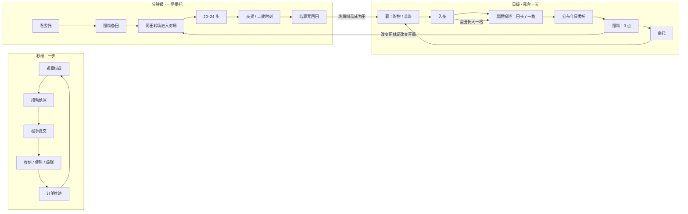
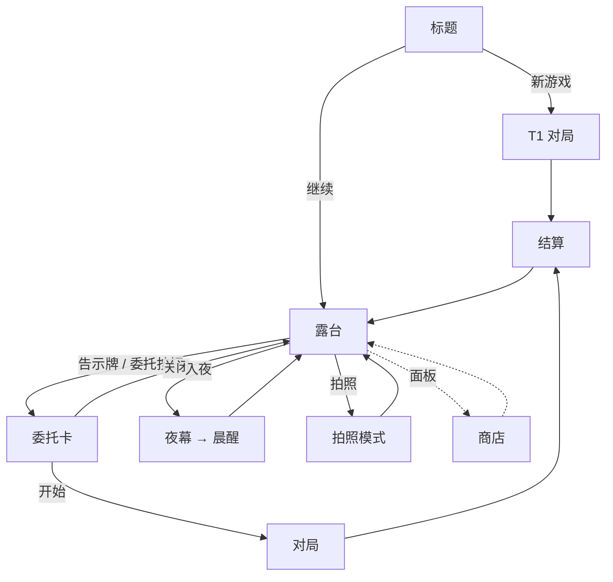

# 01 · 《晨露田园》Dewfield 设计定稿（Design Final）

> 状态：定稿 v3（基于 v2 评审修订，决策依据见 `00-REVIEW.md` 第 3 节）
> 本文定义体验意图、结构和范围。**规则的权威数值和算法以 `02-GDD-SYSTEMS.md` 为准**；技术实现以 `03-TECH-SPEC.md` 为准。

---

## 1. 一句话定位

**你在一座会过夜的玻璃露台上种一块 7×7 的晨露田。接市集委托时，这块田本身变成可滑动的立体棋盘：消除就是收割，也会催熟旁边的作物。打完的田原样留到明天，过一夜会更熟。**

- 类型：网页软 3D 种田 × 消消乐（回合制，没有时间压力）
- 平台：现代浏览器；桌面优先，iPad 横屏友好（见 §4）
- 单场委托：2–4 分钟（20–24 步）；一个游戏日约 5–8 分钟
- 气质：清爽、照料、小成就、收藏欲，有精品独立游戏的质感

## 2. 设计支柱

### 2.1 双核（不可妥协）

| 核 | 玩家要说出的那句话 | 机制落点 |
|---|---|---|
| 消消乐核 | “我算到了，还炸得比想的好看。” | 拖动预演（第一步精确）、非法交换免费、每局 1 次回退、级联、特效与组合、丰收时刻 |
| 种田核 | “这块地因为我照料过，更像我的了。” | 田即棋盘、逐格持久、入夜生长、晨间先看委托再照料、装饰让露台变美 |

### 2.2 五条支柱

1. **算得到（Readable）**：任何一步的第一段结果都能在松手前精确预演，包括收割哪些格、各产出什么、谁会长大、生成或触发什么特效。
2. **炸得漂亮（Surprising）**：级联、特效连锁、组合和丰收时刻都不进预演，结果经常超出预期。
3. **地记得我（Remembered）**：棋盘就是我的田，每一格都会留到明天。
4. **照料有回报（Tending pays）**：照料次数少、价值高、效果当场可见，并决定明天开局。
5. **不惩罚（Kind）**：没有体力，没有枯萎，失败只损失时间，已交的货都算数。

### 2.3 融合原则

消除不是挂在农场皮上的小游戏，露台也不是三消的选关地图。**两者共用同一块地，只是时间尺度不同**：消除以“步”为单位改变这块地，照料和过夜以“天”为单位改变这块地。

## 3. 防换皮检验

### 3.1 已落地的五个融合点

| # | 融合点 | 方向 | 如果删掉它 |
|---|---|---|---|
| F1 | 生长态决定产出，匹配本身会催熟邻格（“先催熟、后收割”） | 种田语义 → 对局决策 | 退化为普通三消 |
| F2 | 田即棋盘，逐格持久 | 对局 ↔ 田 | 露台变成选关界面 |
| F3 | 晨间先看委托，再用照料为开局备田 | 田 → 对局 | 照料变成无意义的日常点击 |
| F4 | 失败后可以入夜，第二天田更熟、委托更容易 | 田 → 对局难度 | 需要付费道具或体力才能兜底 |
| F5 | 特效本身就是种田动作：镰刀割、晨露润、蜂群授粉 | 主题 → 规则 | 特效只是皮 |

### 3.2 新功能准入检验（litmus test）

> 这个功能是让田影响对局，还是让对局影响田？两者都不是，就不进 MVP。

## 4. 目标玩家、平台与会话

- **目标玩家**：25–45 岁的休闲益智玩家（有三消经验），同时喜欢治愈、经营类游戏；在桌面浏览器里利用碎片时间玩，或者在沙发上用平板玩。
- **会话形态**：一次 10–20 分钟，推进 2–3 个游戏日；随时可以离开，只在安全点存档（见 02 §12.4）。
- **平台验收范围（MVP）**：
  - 桌面：Chrome / Edge / Firefox / Safari 最新版，1280×720 及以上；
  - 平板：iPad（A13 及以上）Safari 横屏；
  - 手机竖屏：要求可玩、不裁切（相机自适应），但不做专门优化，也不进验收。
- **语言**：MVP 只做简体中文；所有文案集中在字符串表里，为以后国际化留口子。

## 5. 核心循环（三个时间尺度）



**关键因果链**（设计必须让玩家亲身走一遍）：

> 早上看到“阿麦要 10 个熟胡萝卜” → 发现第 3 行有 4 棵青胡萝卜 → 浇第 3 行，它们当场变熟 → 进入对局，开局第一步就把这一排收进篮子 → “这是我准备的。”

## 6. 结构

```
启幕（标题 + 三行引子）
  └─ 玻璃露台（持久家园，默认状态）
       ├─ 晨露田（7×7，就是棋盘）
       ├─ 市集告示牌 → 委托卡 → 【同田转场】→ 对局 → 结算 → 【同田转场】→ 露台
       ├─ 照料栏（浇垄 / 放蜂）
       ├─ 商店（装饰）
       ├─ 入夜按钮 → 夜幕 → 晨醒
       └─ 拍照模式
```

- **玻璃露台**：永久存档的 3D 家园，也是默认画面。
- **晨露田**：露台中央的 7×7 田，与对局棋盘是同一份数据（02 §6）。
- **市集委托**：有限步数的三消，意义是“今天帮市集一把”。**每个游戏日 1 个主委托**；教程委托 T1、T2 不受此限制。

## 7. 局内玩法（概要；细则见 02 §1–§5）

- **棋盘**：7×7，四向交换，拖动或先后点两格都可以。固定 3/4 俯视（相机俯角约 55°，窄视场），有轻微视差。
- **作物**：5 种，靠剪影和颜色区分。**匹配键只看作物种类**。
- **生长态**：芽（没有产出）/ 青（产 1 露珠）/ 熟（产 1 个作物，先交货，多出的算余量）。
- **邻格催熟**：每个匹配组被收割时，与它正交相邻的作物长大一格（同一步内每格最多 +1）。
- **特效**：4 连得镰刀（收一行或一列）、L/T 得晨露珠（收 3×3，并让外圈长大一格）、5 连得蜂群（与作物交换后，该作物全部授粉变熟再收割）。两个特效交换会触发组合（共 7 种）。
- **预演**：拖向相邻格时显示第一段的完整结果；松手才提交；拖回原位即取消。
- **试错**：非法交换不耗步；每局 1 次回退；闲置 8 秒出现提示。
- **胜负**：交齐订单即胜，随后进入丰收时刻（剩余步数变成镰刀并全部引爆）。步数用完算失败，按部分交货处理（§10）。
- **星级**：一次完成且剩余步数 ≥ 40% 得 3 星，≥ 20% 得 2 星，其余 1 星；多次尝试才完成的固定 1 星。星级不锁任何内容。
- **没有抽象分数**：所有收益都是看得见的东西（作物、露珠）。

## 8. 局外玩法（概要；细则见 02 §6–§10）

- **一日循环**：晨（晨醒揭晓 → 公布委托 → 照料 → 主委托）→ 暮（委托完成后；商店、装饰、剩余照料）→ 入夜（随时可按，第 1 天教程期间除外）。
- **照料**：每天 3 点，不累积。
  - **浇垄**：选一行，该行所有作物当场 +1 生长态；同一行每天只能浇一次。
  - **放蜂**：购买蜂箱后解锁；选一个作物格，它变成蜂群特效格，下一局开局就在；每天 1 次。
- **过夜**：全田 +1 生长态；照料点回满；若没有进行中的委托，则推出下一个。**永不枯萎**。
- **装饰**：8 件，购买后自动摆到固定位置，其中 4 件带小被动。露台按拥有件数升级（3 件升 L2，6 件升 L3），升级时露台外观变化，并开放新装饰。
- **田格提示**：在露台上点任意作物，显示“胡萝卜 · 青 · 明早会熟”。
- **明早预览**（可砍）：按住月亮按钮，田上显示明早的生长态。
- **拍照模式**：隐藏界面，提供 3 个机位，导出带“晨露田园 · 第 N 天”水印的 PNG。

## 9. 田的记忆

| 保留什么 | 何时保留 | 玩家怎么看到 |
|---|---|---|
| 49 格的作物种类、生长态、特效 | 每次结算后整盘写回 | 回到露台时，田与终局棋盘一模一样；收过的地方是新芽 |
| 委托已交数量 | 失败后 | 委托卡显示“还差 4 个” |
| 照料效果 | 当场 | 被浇的那一行立刻长大，行首出现水痕标记 |
| 蜂群 | 放蜂后，直到在对局中被使用 | 露台上那一格有蜜蜂盘旋 |
| 装饰与露台等级 | 永久 | 露台外观 |

**禁止**：对局开始时整盘随机重置；由系统改动作物种类（合法化兜底除外，而且理论上不会触发，见 02 §1.9）。

## 10. 失败与挫败管理

- **失败 = 部分交货**：已交的作物计入委托进度，下次只需补齐剩余；终局田照常写回；余量照常卖出。
- **三种出路**：立刻重来（开局就是当前的田）；先照料再来；或者入夜，明天田更熟再来（委托保留）。
- **中途放弃**：等同失败结算，已交的货同样保留。
- **不存在的惩罚**：体力、生命、枯萎、失败扣钱、连续登录中断，全都没有。
- **失败时的文案**（首次失败提示）：“没关系，交了的都算数。回露台照料一下，明天再来会更容易。”

## 11. 前 10 分钟体验脚本（FTUE）

目标：**90 秒内必出 4 连**（T1 保底），**第 10 分钟产生“想回露台照料”的冲动**（第 2 天晨间）。数据规格见 02 §11。

| 时间 | 场景 | 玩家做什么 | 设计目的 | 验证点 |
|---|---|---|---|---|
| 0:00–0:20 | 标题 → 三行引子 | 点“开始” | 建立“你接手了一座玻璃露台，市集需要帮忙” | — |
| 0:20–1:30 | **T1“第一篮”**（手工棋盘，胡萝卜 ×10，10 步） | 按手势提示走 3 步：三连 → **4 连生成镰刀（约第 45–75 秒）** → 用镰刀收一整行，并带出两段级联 | 教会交换、4 连、特效；第一次“炸得比想的好看” | K1：首次特效时间 ≤ 90 秒 |
| 1:30–2:00 | 结算 → 相机拉回露台 | 看到田就是刚才的棋盘，收过的位置长出新芽 | **田的记忆**第一次出现 | 提示“收过的地方长出了新芽，这块田会记得你” |
| 2:00–4:00 | **T2“看熟了再收”**（就在当前的田上，番茄 ×8，14 步） | 自由对局；按事件弹出情境提示（芽不算数、邻格催熟、晨露珠） | 教会生长态和催熟 | — |
| 4:00–5:00 | 露台：公布 **C01（阿麦：胡萝卜 ×10，24 步）** → 引导浇垄 | 找胡萝卜多的一行浇水，看它当场变熟；另有 2 点照料可以自由使用 | **照料 → 开局**的因果链 | 照料事件（prompted=true） |
| 5:00–7:30 | **C01**（第一场正式委托） | 开局就收获自己浇熟的那一排；完成后第一次看到**丰收时刻** | “这是我准备的” + 终局高潮 | — |
| 7:30–8:30 | 暮：商店开放 | 买第一件装饰（风铃，+1 步），它自动挂上露台 | 家园积累开始 | 购买事件 |
| 8:30–9:00 | 入夜 → 晨醒 | 看全田长大一格的揭晓动画 | 时间期待第一次兑现 | — |
| 9:00–10:00 | 第 2 天晨：公布 **C02（莓姨：蓝莓 ×12）** | 发现田里的蓝莓大多是青的，照料点又回满了 | **“想回露台照料”** | K2：C02 开始前的自发照料（prompted=false） |

第 1 天的功能开放顺序：T1 之后只能打开委托（T2）→ T2 之后开放照料（引导浇垄）→ C01 之后开放商店和入夜 → 第 2 天起全部开放。

## 12. 进度与内容量（MVP）

| 项目 | 数量 |
|---|---|
| 季节 | 1（初夏） |
| 作物 | 5 种 × 3 阶段 = 15 个模型 |
| 特效 / 组合 | 3 种 / 7 种 |
| 委托 | 教程 2 个（T1、T2）+ 手工 12 个（C01–C12）+ 程序化续航 |
| 市集客户 | 4 位（2D 头像 + 一句话文案） |
| 照料动词 | 2 个（浇垄、放蜂） |
| 装饰 / 露台等级 | 8 件 / 3 级 |
| 光照预设 | 3 套（晨、暮、夜） |
| 音频 | 约 25 个音效 + 3 首循环音乐 |
| 手工内容时长 | 约 12 个游戏日，约 70–90 分钟 |

进度曲线（目标值，由平衡模拟校准，见 02 §15）：第 1 次委托后买得起风铃；约第 3 次委托后买得起蜂箱（解锁放蜂）；约第 14 次委托集齐 8 件装饰（进入程序化委托阶段）。

## 13. 美术方向与可读性规则

### 13.1 气质与色板

柔光玻璃、陶土、亚麻，植物颜色克制。露台要有海报感，对局要优先保证清楚。

| 用途 | 色值 |
|---|---|
| 亚麻底（界面面板 / 地面高光） | `#F7F1E8` |
| 鼠尾草绿（主按钮 / 植物叶） | `#5B8F6B` |
| 陶土粉（强调 / 陶盆） | `#D9A39A` |
| 雾蓝（次按钮 / 玻璃反光 / 水） | `#A7C4D0` |
| 炭灰（文字 / 描边） | `#2C2A28` |

### 13.2 作物（剪影优先，颜色辅助）

| 作物 | 剪影 | 主色（熟） | ASCII |
|---|---|---|---|
| 胡萝卜 | 倒锥 + 叶簇 | `#E8894A` | C |
| 番茄 | 扁球 + 星形萼 | `#D2553F` | T |
| 玉米 | 高柱穗 + 包叶 | `#E3BE4F` | M |
| 茄子 | 弯水滴 | `#7B5BA6` | E |
| 蓝莓 | 三颗小球簇 | `#4E78C4` | B |

### 13.3 可读性规则（验收时逐条检查）

1. **RD-1 剪影唯一**：5 种作物在三个阶段都保持可区分的剪影；灰度截图下 ≥ 95% 正确识别。
2. **RD-2 生长态三重编码**：缩放（0.55 / 0.8 / 1.0）+ 颜色（青降饱和 35%、色相向幼果色偏一半，芽完全偏向幼果色；灰度下芽 > 青 > 熟逐级更亮）+ 土壤碟沿（熟为金边），不依赖单一通道。
3. **RD-3 不透明**：作物和碟子一律不透明。透明只允许用于玻璃（单层）和特效粒子（叠加混合）。
4. **RD-4 特效标记**：镰刀带刀刃方向箭头（横/竖），晨露珠带水滴光环，蜂群有独立模型；三者在熟作物之上仍然醒目。
5. **RD-5 预演层级**：收割描边 > 产出浮标 > 生长箭头 > 特效幽灵，四层颜色和形状都要区分开。
6. **RD-6 不遮挡**：从对局相机看，棋盘及其外圈 0.5 格范围内不能有任何装饰或结构遮挡。
7. **RD-7 动效可读**：特效打到格子前至少有 120 ms 的范围预警；级联越深，爆点越大、音高越高。
8. **RD-8 减弱动效**：开启后关闭回弹、屏幕震动和相机漂移，动画整体加速 1.5 倍。

### 13.4 光照与材质

- 静态物体烘焙 AO（作物的 AO 在生成时烘进顶点色）；动态光只用半球光 + 一盏方向光；**MVP 不用实时阴影贴图**，作物下方用斑点阴影。色调映射用 Khronos PBR Neutral，保证作物按设计色显示。
- 玻璃为“假玻璃”：低不透明度（0.15–0.25）的标准材质，加一张自托管的低分辨率环境贴图做反光，不使用透射或折射材质。
- 3 套光照预设：晨（清冷偏暖）、暮（暖橙）、夜（深蓝，仅用于过渡）。

## 14. 音频方向

- **乐器**：马林巴 / 卡林巴（消除）、木吉他 + 轻弦乐（露台）、玻璃风铃（点缀）。
- **级联音阶**：每深一层升一个五声音阶音（C D E G A C′ D′ E′），最多 8 层。
- **环境声**：晨间鸟鸣，夜间虫鸣，浇水时有水声。
- **音乐**：露台·晨、露台·暮、对局，共 3 首无缝循环（60–90 秒）。
- **规则**：首次交互前不播放任何声音；所有声音都受主音量、音乐、音效三个滑杆控制。

## 15. 界面与流程

### 15.1 流程



### 15.2 屏幕与 HUD

| 界面 | 内容 |
|---|---|
| 标题 | 继续 / 新游戏 / 设置；版本号 |
| 露台 HUD | 左上：第 N 天 · 晨/暮；右上：露珠；底部：照料栏（照料点圆点 + 动词按钮）、委托、商店、入夜、拍照、设置 |
| 委托卡 | 客户头像与一句话；订单图标与数量（显示已交/需求）；步数；历史最佳星级；“开始” |
| 对局 HUD | 顶部：订单篮（图标 + 剩余数量）、步数；侧边：露珠、回退（×1）、暂停 |
| 暂停 | 继续 / 放弃委托（等同失败结算）/ 设置 |
| 结算 | 胜负；已交/需求；余量 × 单价；露珠明细；星级；“返回露台” |
| 商店 | 装饰卡（未解锁 / 可买 / 已拥有）；价格；被动说明 |
| 设置 | 主音量 / 音乐 / 音效；减弱动效；画质（自动/高/低）；重置存档（二次确认） |

**布局适配**：宽屏（≥ 4:3）时 HUD 放在棋盘上下或两侧；竖屏时 HUD 在上下两端，棋盘居中并自动取景（03 §8.4）。按钮最小点击区域 44×44 px。

## 16. 成功标准与度量

### 16.1 指标

| # | 成功标准 | 度量 | VS 阈值（PT1） | MVP 阈值（PT2） | 数据来源 |
|---|---|---|---|---|---|
| S1 | 90 秒内打出 4 连 | K1a：T1 中从首次输入到首个特效的时间 | ≥ 90% 的测试者 ≤ 90 秒 | ≥ 95% | 遥测 |
| S1′ | 非教程局也能自然出特效 | K1b：C01 中从首次输入到首个特效的时间 | ≥ 70% ≤ 90 秒 | ≥ 80% | 遥测 |
| S1″ | 棋盘平衡 | 贪心 bot 前 10 步内出特效的概率 | ≥ 85% | ≥ 90% | 平衡模拟 |
| S2 | 前 10 分钟想回露台照料 | K2：C02 开始前做过至少 1 次**自发**照料（prompted=false）的测试者比例 | ≥ 60% | ≥ 70% | 遥测 |
| S2′ | 同上（主观） | 问卷 Q3“我想回去看看、照料我的田”（1–5 分） | 均值 ≥ 3.5 | ≥ 4.0 | 问卷 |
| S3 | 露台可当海报 | 海报测试：3 张露台截图，3 位评审给“愿意当壁纸”打分（1–5） | —（灰盒阶段不测） | 均值 ≥ 4.0 | 评审 |
| S3′ | 对局清晰 | 灰度可读性测试：正确识别作物和生长态的比例 | ≥ 95%（灰盒） | ≥ 95%（正式美术） | 评审 |
| S4 | 外部评价接近“消除是在养自己的田” | 开放题“用一句话向朋友描述这个游戏”，编码后主动提到田/生长/照料的比例 | ≥ 40% | ≥ 50% | 问卷 |
| S5 | 稳定性 | 崩溃、卡死、存档丢失 | 0 起 P0 | 0 起 P0/P1 | 测试记录 |

### 16.2 试玩协议

- **人数**：PT1 ≥ 5 人，PT2 ≥ 8 人；从未接触过本作；三消玩家与经营类玩家各约一半。
- **环境**：全新存档；桌面 Chrome（PT2 另加至少 2 位 iPad 用户）；单次 20 分钟。
- **流程**：前 10 分钟静默游玩，不提示、不出声思考；观察员记录时间点和表情（惊喜 / 困惑 / 挫败）→ 继续玩到 20 分钟 → 填问卷 → 5 分钟访谈。
- **问卷**（1–5 分）：Q1 我能预判一步会发生什么；Q2 连锁常常比我预想的更好看；Q3 我想回去看看、照料我的田；Q4 这块田感觉是我的；Q5 露台好看到想截图。另有开放题：用一句话向朋友描述这个游戏。
- **数据**：在调试面板导出遥测 JSON，用 `pnpm kpi` 生成报告（04 P1-24）。

## 17. MVP 范围与 Post-MVP 路线

### 17.1 MVP 包含

晨露田逐格持久；游戏内日与入夜/晨醒；浇垄、放蜂；5 种作物 × 3 阶段；镰刀、晨露珠、蜂群及 7 种组合；拖动预演、回退、提示；委托（T1、T2、C01–C12 + 程序化）；部分交货；星级；丰收时刻；露珠经济；8 件装饰与露台 3 级；同田转场；3 套光照；音频；设置与减弱动效；拍照模式；版本化存档；本地遥测；平衡模拟。

### 17.2 Post-MVP（按重新进入的优先级排序）

| 系统 | 重新进入条件 | 与双核的连接（必须满足 §3.2） |
|---|---|---|
| 晨露礼（真实时间回访加成） | PT2 的 Q3 ≥ 4 且次日回访数据可得 | 田：跨会话的时间期待 |
| 选种（第 6 种作物，本季种哪 5 种） | 5 种作物的平衡稳定 | 田 → 对局：改变棋盘构成 |
| 加分小单（每日第二局） | 玩家反馈“一天想多打” | 对局 → 田：更多写回 |
| 肥力（地块层属性） | 数据模型已预留地块层 | 田 → 对局：空间性生长加成 |
| 料理（消耗作物 → 解锁装饰或被动） | 经济出现通胀，需要消耗口 | 对局产出 → 家园 |
| 四季 | 内容产能允许 | 田外观与作物组合 |
| 图鉴 | 收藏动机数据偏弱 | 家园归属 |
| 石盆 / 雨雾日（氛围规则） | 需要中期新鲜感 | 对局的新规则 |
| 自由摆放装饰 | 露台美术模块化完成 | 家园归属 |
| 英文本地化、手机竖屏优化、云存档 | 发行需要 | — |

## 18. 术语表

| 中文 | English | 说明 |
|---|---|---|
| 玻璃露台 | Glass Terrace | 枢纽 / 家园场景 |
| 晨露田 | the Field | 7×7 田，等同棋盘 |
| 作物格 | Tile | 会移动的格子：作物 + 生长态 + 特效 |
| 地块 | Plot | 不动的位置（MVP 没有属性，预留给肥力） |
| 生长态：芽 / 青 / 熟 | Stage: Sprout / Unripe / Ripe | 0 / 1 / 2 |
| 邻格催熟 | Neighbor Ripening | 匹配使正交相邻的作物 +1 |
| 市集委托 | Market Commission | 一场对局的目标容器 |
| 订单 | Order | 委托中的作物需求（1–2 项） |
| 交货 / 余量 | Deliver / Surplus | 熟作物先计入订单，超出部分为余量 |
| 部分交货 | Partial Delivery | 失败时已交的数量保留 |
| 镰刀 / 晨露珠 / 蜂群 | Sickle / Dew Orb / Bee Swarm | 三种特效 |
| 组合 | Combo | 两个特效交换 |
| 丰收时刻 | Harvest Rush | 胜利后剩余步数转为镰刀并全部引爆 |
| 预演 | Preview | 拖动时显示第一段结果 |
| 回退 | Undo | 每局 1 次 |
| 照料 / 照料点 | Tending / Care Points | 每天 3 点 |
| 浇垄 / 放蜂 | Water a Row / Release Bees | 两个照料动词 |
| 入夜 / 晨醒 | Sleep / Morning Reveal | 推进游戏日 |
| 露珠 | Dewdrop | 唯一货币 |
| 育苗架 | Nursery Edge | 补位进场的一侧（棋盘远端） |
| 露台等级 | Terrace Level | 由拥有的装饰件数决定 |
