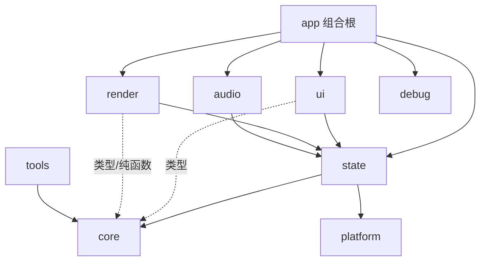
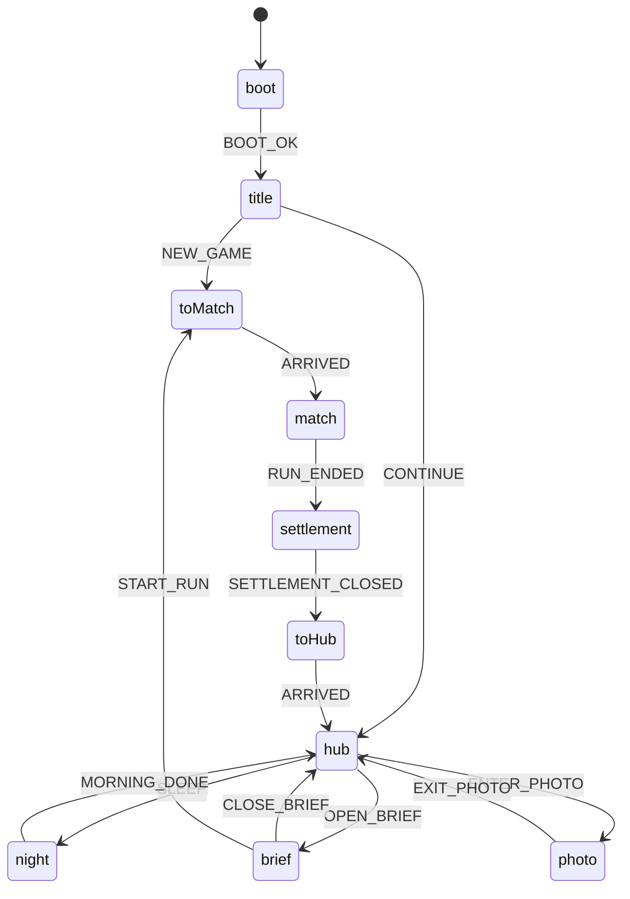

# 03 · 技术规格（Tech Spec）

> 本文是技术实现的权威来源。规则语义以 `02-GDD-SYSTEMS.md` 为准；本文只规定“怎么实现、实现边界在哪里、如何验证”。
> 版本号于 **2026-09-26** 在 npm 上实测，并核对过 peer 依赖。

---

## 1. 技术目标与约束

| 维度 | 目标 |
|---|---|
| 平台 | 桌面 Chrome / Edge / Firefox / Safari 最新版；iPad（A13+）Safari 横屏。手机竖屏可玩但不进验收 |
| 图形 | WebGL2（R3F 默认的 `WebGLRenderer`）；MVP 不使用 WebGPU |
| 帧率 | 参考设备上平均 ≥ 55 fps，p95 帧时间 ≤ 22 ms（§13） |
| 离线 | 首次加载后不依赖网络；运行时禁止访问任何 CDN |
| 数据 | 纯本地：localStorage 存档 + 本地遥测；没有后端 |
| 核心要求 | **棋盘与领域逻辑是纯 TS，与渲染完全分离，能在 Node 中单测和批量模拟** |

---

## 2. 技术栈与版本（锁定）

采用用户指定的默认栈：**Vite + React + TypeScript + Three.js / R3F + Zustand + Howler**。在此基础上补充 zod（存档校验）、maath（缓动与数学）、Vitest / fast-check / Playwright（测试），不改栈。

### 2.1 运行时依赖

| 包 | 版本 | 用途 / 备注 |
|---|---|---|
| react / react-dom | 19.3.0 | R3F 9.8 要求 `>=19 <19.4` |
| three | 0.186.1 | |
| @react-three/fiber | 9.8.1 | v10 仍是 alpha，**不用** |
| @react-three/drei | 10.7.9 | 只用 `PerformanceMonitor`、`useGLTF` 等少数工具；**禁用会从 CDN 拉资源的 `Environment preset`** |
| zustand | 5.0.15 | |
| howler | 2.2.4 | 通过 `AudioEngine` 接口隔离（§11） |
| zod | 4.6.5 | 存档 schema；允许在 core 中使用 |
| maath | 0.10.8 | 缓动函数 |
| leva | 0.10.1 | 只在调试面板中动态导入 |
| r3f-perf | 7.2.3 | 只在调试面板中动态导入 |
| （Could）@react-three/postprocessing + postprocessing | 3.1.2 + 6.39.5 | 仅“高”画质的晕影和轻微泛光；MVP 可不接入 |

### 2.2 开发依赖

| 包 | 版本 | 备注 |
|---|---|---|
| vite | 8.3.1 | 要求 Node `^20.19 \|\| >=22.12` |
| @vitejs/plugin-react | 6.1.1 | 要求 vite ^8；**MVP 不启用 React Compiler** |
| typescript | **~6.0.3** | ⚠ `latest` 是 7.0.x，但 `typescript-eslint@8.70` 要求 `typescript <6.1`，所以锁定 6.0.x（00 D-25） |
| @types/react / @types/react-dom | 19.3.0 | |
| @types/three | 0.186.0 | |
| @types/howler | 2.2.13 | |
| @types/node | ^22 | 与 Node 运行时对齐 |
| vitest / @vitest/coverage-v8 | 5.0.2 | 要求 Node `^22.12 \|\| ^24` |
| jsdom | 30.1.1 | UI 测试环境 |
| @testing-library/react (+ @testing-library/dom ^10) | 16.3.3 | |
| fast-check | 4.10.2 | 属性测试 |
| @playwright/test | 1.63.0 | e2e 冒烟 |
| eslint | 10.11.0 | 只用 flat config |
| typescript-eslint | 8.70.1 | |
| eslint-plugin-react-hooks | 7.1.1 | |
| eslint-plugin-react-refresh | 0.5.7 | |
| globals | 17.12.0 | |
| prettier | 3.9.9 | |
| tsx | 4.23.15 | 在 Node 中运行 `tools/*` |
| @gltf-transform/cli | 4.5.0 | 资产压缩 |
| subset-font | 2.9.0 | 展示字体子集化 |

### 2.3 运行环境

- Node：`>=22.12`（`.nvmrc` 写 `22`；24 LTS 同样可用）。
- 包管理：pnpm，`package.json` 中写 `"packageManager": "pnpm@10.33.3"`；锁文件必须提交。
- 版本策略：`package.json` 写精确版本；升级依赖单独开任务，并跑完整 CI 和黄金回放。

### 2.4 明确不用的东西（及理由）

| 不用 | 理由 |
|---|---|
| Tailwind / shadcn/ui 等组件库 | 游戏 HUD 是定制视觉，组件少于 20 个；用 CSS Modules + 设计 token（`ui/tokens.css`）足够，也避免第二套样式体系 |
| XState 等状态机库 | 状态机规模小；用手写的纯函数转移表，便于单测，也少一个依赖 |
| GSAP / react-spring | 编排需要由事件日志驱动、可暂停、可变速、可跳到结尾，自研约 150 行的时间线更可控 |
| 物理引擎 | 规则是离散网格，“软滚动”只是缓动曲线 |
| 路由库 | 界面切换由 App 状态机驱动 |
| 后端 / 云存档 | MVP 范围外 |

---

## 3. 目录结构

```
dewfield/
├─ docs/                          # 00–05 文档；archive/（原始方案）；balance/（模拟报告）；playtests/（试玩报告）
├─ public/
│  ├─ models/                     # 压缩后的 .glb
│  ├─ env/                        # 自托管环境贴图（≤ 256px）
│  ├─ audio/                      # sfx 精灵（webm + mp3 + json）、music/
│  └─ fonts/                      # 展示字体的 OFL 许可（子集本身在 src/ui/fonts/，经 Vite 带哈希输出）
├─ src/
│  ├─ main.tsx
│  ├─ app/                        # 组合根：App.tsx、Canvas 挂载、按 App 状态机切换界面
│  ├─ core/                       # 纯 TS 领域层（只允许依赖 zod）
│  │  ├─ util/                    # hash、invariant、类型工具
│  │  ├─ rng/                     # 带种子的 PRNG
│  │  ├─ config/                  # tunables、crops、decor、commissions、clients、tips、tutorial/
│  │  ├─ board/                   # model、ascii、match、specials、combos、resolve、gravity、refill、moves、shuffle、generate、preview、replay
│  │  ├─ growth/                  # stage、ripen、overnight
│  │  ├─ commission/              # order、stars、sequence、generator
│  │  ├─ run/                     # RunState、createRun、applyMove、undo、rush、result
│  │  ├─ homestead/               # state、newHomestead、startRun、settleRun、care、decor、day、modifiers
│  │  ├─ flow/                    # appFsm、runFsm、gesture、tutorial
│  │  ├─ save/                    # schema、serialize、migrations
│  │  └─ telemetry/               # 事件类型、KPI 计算
│  ├─ state/                      # Zustand stores、controllers/、bus、persistence、telemetryLogger
│  ├─ render/
│  │  ├─ Stage.tsx                # Canvas 内的根节点
│  │  ├─ field/                   # FieldView、TilePool、PlotLayer、PreviewOverlay、tileLook
│  │  ├─ terrace/                 # Terrace（灰盒版 → 正式版）、DecorSpots、Signboard、RowHighlight
│  │  ├─ camera/                  # CameraRig、poses、fit
│  │  ├─ lighting/                # LightingRig、presets、SkyDome
│  │  ├─ vfx/                     # particles、SickleSweep、DewBurst、BeeSwarm、YieldFly、WateringFx 等
│  │  ├─ choreo/                  # timeline、builder、easing、consistency
│  │  ├─ input/                   # pick、useBoardGestures、useHubPicking
│  │  └─ assets/                  # manifest、greybox、loaders
│  ├─ ui/
│  │  ├─ strings/zh-CN.ts
│  │  ├─ tokens.css               # 色板、圆角、间距、字号
│  │  └─ title/ hub/ match/ settlement/ shop/ overlays/ tutorial/ settings/ common/
│  ├─ audio/                      # AudioEngine 接口、HowlerEngine、AudioDirector、cueMap
│  ├─ platform/                   # storage、clock、visibility、webglContext、tabLock、buildInfo
│  └─ debug/                      # DebugPanel、TelemetryExport、autoplay、bench（只允许动态导入）
├─ tools/
│  ├─ sim/                        # cli、bots、policies、metrics、report、guard.test.ts
│  ├─ kpi/                        # cli、report
│  └─ assets/                     # optimize.mjs、subset-font.mjs
├─ tests/
│  ├─ e2e/                        # Playwright
│  ├─ fixtures/                   # replays/、saves/、telemetry/
│  └─ lint/                       # 分层守卫测试
├─ scripts/ci.sh
├─ index.html  package.json  pnpm-lock.yaml  tsconfig.json
├─ vite.config.ts  vitest.config.ts  playwright.config.ts  eslint.config.js  .prettierrc  .nvmrc
└─ README.md
```

单元测试与源文件放在一起（`*.test.ts`），跨模块的夹具放在 `tests/fixtures/`。

---

## 4. 分层与模块边界



| 层 | 可以依赖 | 禁止依赖（由 ESLint 强制，04 P0-02） |
|---|---|---|
| `core` | `zod`，以及 core 内部 | `react*`、`three`、`@react-three/*`、`zustand`、`howler`、任何 `@/state` `@/render` `@/ui` `@/audio` `@/platform` `@/debug` `@/app`；全局 `window` `document` `localStorage` `performance` `requestAnimationFrame`；`Math.random`、`Date.now`、`new Date()` |
| `state` | `core`、`platform`、`zustand` | `three`、`@react-three/*`、`@/render`、`@/ui`、`@/audio` |
| `render` | `core`、`state`（读 store、订阅 bus）、`three`、`@react-three/*`、`maath` | `@/ui`、`@/audio` |
| `ui` | `core`（类型与纯函数）、`state`、`react` | `three`、`@react-three/*`、`@/render`、`@/audio` |
| `audio` | `core`（事件类型）、`state`（bus）、`howler` | `@/render`、`@/ui` |
| `platform` | 浏览器 API | `@/state`、`@/render`、`@/ui`、`@/audio` |
| `debug` | 全部 | 只能被 `import()` 动态导入 |
| `app` | 全部 | — |
| `tools` | `core`（在 Node 中运行）；`tools/assets` 另可读 `render/assets` 与 `three`（00 D-37） | 浏览器相关的层 |

路径别名只有一个：`@/*` → `src/*`。TS 6 已弃用 `baseUrl`，所以 `paths` 不要配 `baseUrl`。

---

## 5. core 领域 API

以下是签名草案，实现时可以增加内部辅助函数，但**对外签名变化必须同步更新本节**。所有函数都不修改入参。

### 5.1 随机数 `core/rng`

```ts
export type RngState = readonly [number, number, number, number];     // sfc32，4 个 uint32
export function createRng(seed: number): RngState;
export function nextU32(s: RngState): [number, RngState];
export function nextInt(s: RngState, min: number, maxExclusive: number): [number, RngState];  // 拒绝采样，无取模偏差
export function pickWeighted(s: RngState, weights: readonly number[]): [number, RngState];      // 整数权重
export function shuffle<T>(s: RngState, arr: readonly T[]): [T[], RngState];                    // Fisher–Yates
export function deriveSeed(...parts: (number | string)[]): number;                              // FNV-1a 32 位 + 混合
```

### 5.2 棋盘模型 `core/board/model.ts`

```ts
export interface Pos { readonly x: number; readonly y: number }
export interface Move { readonly a: Pos; readonly b: Pos }                  // a = 被拖动的格
export interface Board { readonly width: 7; readonly height: 7; readonly cells: readonly Tile[] }  // 长度 49，行优先
export const idx: (p: Pos) => number;
export const posOf: (i: number) => Pos;
export function neighbors4(p: Pos): Pos[];                                  // 按 index 序
export function hashBoard(b: Board): string;                                 // 规范化 JSON 的 FNV-1a
```

### 5.3 函数清单

| 模块 | 函数 | 说明 |
|---|---|---|
| `board/ascii` | `parseBoard(ascii, uidStart) → { board, nextUid }` / `printBoard(board) → string` / `parseToken` / `printToken` | 02 §1.10 |
| `board/match` | `findGroups(board) → MatchGroup[]` / `creationPos(group, ctx) → Pos \| null` | 02 §1.4–1.5 |
| `board/moves` | `classifySwap(board, move) → 'match' \| 'combo' \| 'bee' \| null` / `findValidMoves(board) → Move[]` | 02 §1.3、§1.8 |
| `board/specials` | `effectOf(tile, pos, board, H) → { cells, ring, pollinated }` / `closeChain(board, H, triggers) → { H, ring, P, activations }` | 02 §3.1–3.4 |
| `board/combos` | `resolveCombo(board, move) → Step0` | 02 §3.5 |
| `board/resolve` | `resolveSteps(state, ctx) → { board, rng, uidCounter, spawnQueue, events, depth }` | 02 §1.6 的第 4 步 |
| `board/gravity` / `board/refill` | `applyGravity(board)` / `refill(board, rng, queue, weights)` | 02 §1.7 |
| `board/shuffle` / `board/generate` | `shuffleBoard(board, rng, cfg)` / `generateBoard(rng, stageWeights, cfg)` / `legalizeBoard(board, rng, cfg)` | 02 §1.8–1.9 |
| `board/preview` | `previewMove(run, move, cfg) → PreviewResult` | 02 §4.1；不推进 RNG |
| `board/replay` | `applyEventToBoard(board, event) → board` / `replayEvents(board, events) → board` | 渲染契约与测试 |
| `run` | `createRun(input, cfg)` / `applyMove(run, move, cfg)` / `undo(run)` / `harvestRush(run, cfg)` / `runResult(run)` | 02 §4.2、§5 |
| `commission` | `activateNext(home, cfg)` / `generateCommission(home, n, cfg)` / `computeStars(run, cfg)` | 02 §5.4–5.6 |
| `homestead` | `newHomestead(seed, cfg)` / `startRun(home, cfg)` / `settleRun(home, run, cfg)` / `careWaterRow(home, y, cfg)` / `carePlaceBee(home, pos, cfg)` / `sleep(home, cfg)` / `purchaseDecor(home, id, cfg)` / `effectiveModifiers(home)` / `terraceLevel(home, cfg)` / `pickWaterRowHint(field, crop)` | 02 §6–§9 |
| `flow` | `appTransition(state, event)` / `gestureReduce(state, input, cfg)` / `runPhaseTransition(state, event)` / `tutorialGate(home)` / `tutorialOnEvent(home, evt)` | §7 |
| `save` | `SaveFileSchema` / `serialize(home, meta)` / `deserialize(raw)` / `migrate(obj)` / `CURRENT_SCHEMA_VERSION` | 02 §12 |
| `telemetry` | 事件类型 / `computeKpis(events) → KpiReport` | 02 §13 |

返回值约定：预期内的失败（非法交换、照料不允许、买不起）返回 `{ ok: false, reason }`；程序错误（违反不变量）由 `invariant()` 抛出。

### 5.4 棋盘事件 `BoardEvent`（渲染契约）

```ts
type Yield = 'crop' | 'dewdrop' | 'none';
type Via = 'match' | 'chain' | 'combo' | 'swap' | 'rush';

export type BoardEvent =
  | { t: 'swap'; a: Pos; b: Pos; uidA: number; uidB: number }
  | { t: 'swapRejected'; a: Pos; b: Pos }
  | { t: 'cascadeStep'; depth: number }                                     // 第 0 步不发此事件
  | { t: 'match'; groups: { crop: CropId; cells: Pos[]; shape: Shape }[] }
  | { t: 'specialTriggered'; pos: Pos; uid: number; kind: SpecialKind; via: Via; area: Pos[]; level: number }  // level = BFS 层
  | { t: 'pollinate'; cells: Pos[] }
  | { t: 'harvest'; items: { pos: Pos; uid: number; crop: CropId | null; stage: Stage | null; yield: Yield; delivered: boolean }[] }  // stage = 产出所依据的生长态（授粉时为 2），00 D-28
  | { t: 'specialCreated'; pos: Pos; uid: number; kind: SpecialKind; crop: CropId | null; stage: Stage | null }  // stage 让重放不依赖调参，00 D-28
  | { t: 'convert'; items: { pos: Pos; uid: number; kind: CropSpecial }[]; cause: 'bee' | 'rush' }  // 同一 uid 获得特效
  | { t: 'grow'; items: { pos: Pos; uid: number; from: Stage; to: Stage }[]; cause: 'neighbor' | 'dewRing' | 'water' | 'overnight' }
  | { t: 'fall'; items: { uid: number; from: Pos; to: Pos }[] }
  | { t: 'spawn'; items: { uid: number; pos: Pos; token: string; entryOffset: number }[] }
  | { t: 'shuffle'; items: { uid: number; from: Pos; to: Pos }[] }
  | { t: 'recolor'; items: { uid: number; pos: Pos; crop: CropId }[] }
  | { t: 'beePlaced'; pos: Pos; uid: number; replacedUid: number }
  | { t: 'rushStart'; conversions: number }
  | { t: 'rushEnd' }
  | { t: 'runEnded'; result: 'won' | 'lost' };
```

露台层的非棋盘事件单独定义，由 `purchaseDecor` 返回，供商店与升级演出使用：

```ts
export type HomesteadEvent =
  | { t: 'decorPurchased'; id: DecorId; price: number }
  | { t: 'terraceLevelUp'; level: 2 | 3 };
```

- 一个结算步内的事件顺序固定为：`cascadeStep → match → specialTriggered* → pollinate? → harvest → specialCreated* → grow{dewRing}? → grow{neighbor}? → fall → spawn`。
- 同一步内的生长按来源拆成最多两个 `grow` 事件：先 `dewRing`，后 `neighbor`；同时满足两种来源的格只出现在 `dewRing` 事件中（每格每步最多 +1，02 §2.2）。每个事件内的 items 按 index 序排列。
- **可重放性（必须）**：`replayEvents(initialBoard, events)` 的结果必须等于 `applyMove` 返回的最终棋盘（04 P0-09 的属性测试）。表现层也用同一个 `applyEventToBoard` 维护“已呈现棋盘”。

### 5.5 确定性契约

1. 所有随机都经由 `core/rng`，状态显式存放在 `RunState.rng` 或由 `HomesteadState.seed` 派生。
2. core 中不读取墙钟；需要时间的函数（如存档元数据）由调用方传入 `nowMs`。
3. 迭代顺序一律按 index 序或显式排序；输出用数组，不用 Set 或 Map 的迭代顺序决定逻辑。
4. 规则只用整数运算；权重是整数；`nextInt` 用拒绝采样。
5. 状态都是纯 JSON（不放 Map、Set 或类实例），`hashState` 对规范化 JSON 做哈希。
6. 相同的“初始状态 + 输入序列”，在任何浏览器和 Node 中都必须得到相同的“状态 + 事件”。黄金回放测试会守住这一点。

---

## 6. 状态管理（Zustand）

| Store | 内容 | 谁写 | 谁读 |
|---|---|---|---|
| `appStore` | `appState`（App 状态机）、`home: HomesteadState`、`settings`、`notices[]` | controllers | ui、render（模式切换） |
| `runStore` | `run: RunState \| null`（逻辑态，立即提交）、`runPhase`、`gesture`、`preview`、`hint` | runController | render（预演）、ui |
| `presentationStore` | `presentedBoard`、`hud: { delivered, movesLeft, dewdrops, undoLeft }`、`busy` | 编排器 cue | ui（HUD 数字）、调试面板 |
| `uiStore` | 面板开关、`careMode: 'none' \| 'water' \| 'bee'`、提示队列、tooltip | ui、controllers | ui、render（行高亮） |

**Controllers**（`src/state/controllers/*.ts`，普通 TS 模块，不是 React 组件）：

- `gameController`：启动、新游戏、继续、App 状态机派发与副作用。
- `runController`：开局、提交一手、回退、放弃、结束，并推动 run 状态机。
- `hubController`：照料、购买、入夜、教程闸门。
- `persistence`：02 §12.4–12.8 的读写流程。
- `telemetryLogger`：写入环形缓冲。

**事件总线** `state/bus.ts`：类型化的发布/订阅（`boardEvents`、`cue`、`appTransition`），供编排器与音频订阅，不经过 React。

**规则**：组件只用 selector 订阅所需字段（多字段时用 `useShallow`）；`useFrame` 内用 `store.getState()` 读取瞬时状态，不触发重渲染；store 中不存放 Three 对象。

---

## 7. 状态机

四个状态机都实现为 `core/flow` 中的纯转移函数 `(state, event) → { state, effects[] }`，由 controllers 执行副作用。转移表中的每一条边都要有单测。

### 7.1 App 状态机



| 从 | 事件 | 到 | 守卫 | 副作用 |
|---|---|---|---|---|
| boot | BOOT_OK | title | — | 读取设置与存档 |
| title | NEW_GAME | toMatch | 已有存档时 UI 先二次确认 | `newHomestead` → `startRun(T1)` → 存档 |
| title | CONTINUE | hub | 存档存在 | — |
| hub | OPEN_BRIEF | brief | 有进行中的委托，且 `phase = morning`，且闸门允许 | — |
| brief | CLOSE_BRIEF | hub | — | — |
| brief | START_RUN | toMatch | — | `startRun` → 存档（runCounter）→ 遥测 `run_start` |
| toMatch / toHub | ARRIVED | match / hub | 相机补间结束 | run 状态机进入 `intro` / 重新计算教程闸门 |
| match | RUN_ENDED | settlement | run 状态机到达 `ended` | `settleRun` → 存档 → 遥测 `run_end` |
| settlement | SETTLEMENT_CLOSED | toHub | — | — |
| hub | SLEEP | night | 闸门允许；有剩余照料点时 UI 先确认 | `sleep` → **先存档** → 播放夜幕与晨醒 |
| night | MORNING_DONE | hub | 动画结束或被跳过 | 弹出委托卡 |
| hub | ENTER_PHOTO / photo EXIT_PHOTO | photo / hub | — | 隐藏或恢复 HUD |

设置面板、暂停菜单、商店面板和照料模式属于 `uiStore` 中的叠加状态，不是 App 状态。

### 7.2 Run 状态机

| 从 | 事件 | 到 | 副作用 |
|---|---|---|---|
| intro | INTRO_DONE | idle | 启动闲置提示计时 |
| idle | INTENT_PREVIEW(move) | idle | `preview = previewMove(...)` |
| idle | INTENT_CLEAR | idle | `preview = null` |
| idle | INTENT_COMMIT(move) · 合法 | resolving | `applyMove` → 立即提交逻辑态 → 编排器播放 |
| idle | INTENT_COMMIT(move) · 非法 | rejecting | 播放 `swapRejected` |
| rejecting | TIMELINE_DONE | idle | — |
| resolving | TIMELINE_DONE | idle / rush / ended | 由 `run.status` 与是否需要丰收时刻决定 |
| rush | TIMELINE_DONE | ended | — |
| idle | UNDO | idle | `undo(run)`，呈现层直接切换 |
| 任意 | PAUSE / RESUME | （paused 标志） | 时间线 `timeScale = 0` / 恢复 |
| paused | ABANDON | ended | 按失败结算 |

`resolving` 期间点击屏幕 → `timeScale = anim.fastForwardScale`；此时棋盘输入被忽略。

### 7.3 手势状态机（`core/flow/gesture.ts`，纯函数，输入是抽象事件）

- **输入**：`down(cell | null, px)`、`move(cell | null, px)`、`up(cell | null, px)`、`cancel`。
- **输出（意图）**：`select(a)`、`preview(a, b)`、`clearPreview`、`commit(a, b)`、`deselect`。

| 状态 | 输入 | 条件 | 下一状态 | 输出 |
|---|---|---|---|---|
| idle | down(a) | a 非空 | pressing(a, p0) | — |
| pressing | move(p) | 位移 ≥ 阈值 | dragging(a, b) | `preview(a, b)`，b = a 沿主方向的邻格（出界则为 null，不输出） |
| dragging | move(p) | 主方向改变 | dragging(a, b′) | `preview(a, b′)` |
| dragging | move(p) | 回到阈值以内 | pressing | `clearPreview` |
| dragging | up | b 非空 | idle | `commit(a, b)` |
| pressing | up | — | selected(a) | `select(a)` |
| selected | down / up(c) | c 与 a 相邻 | idle | `commit(a, c)` |
| selected | down / up(c) | c == a | idle | `deselect` |
| selected | down / up(c) | c 不相邻 | selected(c) | `select(c)` |
| 任意 | cancel | — | idle | `clearPreview` |

阈值取 `input.dragThresholdPx` 与 `input.dragThresholdCell × 单格屏幕尺寸` 中先到者；只响应主指针。

### 7.4 一日阶段机 / 7.5 教程闸门

规则见 02 §6、§11.1。实现为 `homestead/day.ts` 与 `flow/tutorial.ts` 中的纯函数；UI 通过 `tutorialGate(home).allow` 决定哪些按钮可点。

---

## 8. 渲染架构

### 8.1 单一画布、田不重建（00 D-13）

- `app/App.tsx` 在启动后挂载**唯一的** `<Canvas>`，此后不再卸载。DOM 层的 HUD 覆盖在它上面。
- Canvas 内部固定包含：`LightingRig`、`SkyDome`、`Terrace`（露台与装饰）、`FieldView`（地块 + TilePool）、`VfxLayer`、`CameraRig`、`PreviewOverlay`、`HubPickers`。
- 露台、对局、拍照模式只改变相机机位、可交互性和部分物体的可见性。**`FieldView` 在任何模式下都不卸载**（04 P1-20 用挂载计数验收）。
- Canvas 参数：`dpr={[1, render.dprMax]}`、`gl={{ antialias: true, powerPreference: 'high-performance' }}`、`shadows={false}`、`frameloop="always"`（标签页隐藏时浏览器会自动暂停 rAF）。

### 8.2 TilePool：对象池 + 命令式更新

- 池容量 112 个槽位（49 格，加上一步内“收割中”和“进场中”同时存在的余量；蜂群 + 蜂群的极端情况约为 98）。
- 每个槽位有一个作物本体 `Mesh`，几何体与材质按 (作物, 生长态) 从缓存中切换。
- 共享的实例化图层：熟作物金边（1 个 InstancedMesh）、特效标记（每种 1 个，共 4 个）、斑点阴影（1 个）、地块碟（1 个，49 个静态实例）。
- API：`acquire(uid, token, pos)`、`release(uid)`、`get(uid)`、`setStage(uid, stage)`、`setSpecial(uid, kind)`、`markDirty(uid)`。每帧只为 dirty 槽位写实例矩阵。
- React 只在挂载时渲染一次对象池，此后所有更新都是命令式的，**每帧零 React 渲染**。
- 对局视图的 draw call 预算：约 49（本体）+ 1（金边）+ 4（标记）+ 1（阴影）+ 1（地块）≈ 56，余量留给特效，总计 ≤ 100。

### 8.3 几何体与材质

- 所有几何体和材质都放在模块级缓存中共享，**禁止为单个格子克隆材质**。
- 作物材质：5 种作物 × {熟, 青} = 10 个 `MeshStandardMaterial`（高粗糙度、零金属度）；芽使用叶片材质加作物色芽苞（顶点色）。作物相关材质总数 ≤ 16。
- 颜色按 02 §16.1；青的饱和度降低 35%（在材质颜色上预先计算）。

### 8.4 相机与取景

- 机位定义在 `render/camera/poses.ts` 中：`title`、`hub`、`match`、`photo1..3`，每个包含 `{ position, target, fov }`。对局机位俯角约 55°，fov 约 30°（接近正交，便于阅读）。
- **对局自适应取景**：纯函数 `fitDistance(box, viewDir, fov, aspect, insets)`，沿视线方向二分搜索 20 次，找到能让“棋盘 + 0.5 格外圈”的投影落入安全区的最小距离。安全区 = 视口减去 HUD 占位（横屏上 96px、下 72px；竖屏上 120px、下 140px）。三种宽高比（16:9、4:3、9:16）都要有单测。
- **转场**：位置、目标点和 fov 用 easeInOutCubic 补间，时长 `anim.cameraTransition`；减弱动效时缩短一半。
- **视差**：闲置时相机随指针偏移 ±0.15 单位（lerp 0.05）；减弱动效时关闭。

### 8.5 光照预设

- `presets.ts` 定义 `morning`、`dusk`、`night`：半球光的天空色、地面色与强度；方向光的颜色、强度与方向；雾的颜色与远近；天空穹顶的上下两色；玻璃色调。
- `LightingRig` 在预设之间做 lerp，时长 `anim.nightFade`。

### 8.6 特效（VFX）

- 统一粒子系统：1 个 InstancedMesh 的面片，叠加混合，上限 `render.particlesMax`。
- 效果组件都做池化：`SickleSweep`（刀刃网格 + 拖尾面片）、`DewBurst`（扩张环着色器 + 水滴粒子）、`BeeSwarm`（实例化蜜蜂沿贝塞尔曲线飞行）、`YieldFly`（产出图标飞向 HUD 订单篮，目标位置由 DOM rect 在固定深度 unproject 得到）、`GrowPop`、`MatchFlash`（本体自发光脉冲）、`WateringFx`、`MorningSparkles`。
- 每个会伤害格子的特效，必须先播放不少于 `anim.specialTelegraph` 的范围预警（01 RD-7）。

### 8.7 渲染硬性约束（代码评审逐条检查）

1. 作物和地块一律不透明；透明只允许用于玻璃（单层、`depthWrite: false`、在不透明物体之后绘制）和叠加混合的粒子。
2. MVP 不使用实时阴影贴图，用斑点阴影。
3. 运行时不访问任何 CDN；环境贴图自托管在 `public/env/`。
4. 贴图边长为 2 的幂且 ≤ 1024。
5. `useFrame` 内不分配对象（复用临时向量）。
6. 动画不走 React state。
7. 只用 WebGL2。

---

## 9. 动画编排（00 D-18）

### 9.1 管线

```
runController.commit(move)
  → core.applyMove(run, move)                 → { run', events }
  → runStore.run = run'                        （逻辑态立即提交）
  → runPhase = 'resolving'
  → choreographer.play(events)                 → 由 builder 生成 Timeline
       每帧：timeline.advance(dt × timeScale)
       cue 触发：presentation.applyEvent(e)    （更新 presentedBoard 与 HUD）
                 bus.emit('cue', e)            （音频）
  → 完成：一致性断言（§9.6）→ runPhase = 下一状态
```

### 9.2 Timeline API（`render/choreo/timeline.ts`，不依赖 Three，可在 Node 中测试）

```ts
interface Track { start: number; duration: number; update(t01: number): void; onStart?(): void; onEnd?(): void }
interface Cue { at: number; fire(): void }
class Timeline {
  add(track: Track): void;
  cue(at: number, fire: () => void): void;
  advance(ms: number): void;        // 按时间顺序依次触发 onStart / update / onEnd / cue
  skipToEnd(): void;                // 按顺序立即执行完剩余的全部内容
  readonly duration: number;
  readonly done: boolean;
}
buildTimeline(events: BoardEvent[], adapters: ChoreoAdapters, timing: AnimTunables): Timeline;
```

`ChoreoAdapters` 是 TilePool、VFX 和 HUD 的接口。测试时注入会记录调用的假实现，断言轨道的开始时间和调用顺序。

### 9.3 事件到表现的映射

| 事件 | 表现 | 时长 | 是否阻塞后续 |
|---|---|---|---|
| swap | 两格位置互换 | `anim.swap` | 是 |
| swapRejected | 过去再回来 | `anim.swapRejected` | 是 |
| cascadeStep（depth > 1） | 段间停顿 | `anim.cascadeGap` | 是 |
| match | 组内格子自发光闪一下 | `anim.matchFlash` | 是 |
| specialTriggered | 范围预警，然后播放特效；按 BFS 层依次错开 `anim.chainDelay` | 预警 + 特效时长 | 是 |
| pollinate | 蜜蜂飞向目标 | `anim.beeFlight` | 是 |
| harvest | 弹出（缩放 1 → 1.2 → 0）并释放槽位；产出图标飞向 HUD | `anim.harvestPop`（飞行 `anim.yieldFly`，不阻塞） | 弹出阻塞 |
| specialCreated | 新特效格在原位长出，带闪光 | `anim.spawnPop` | 与 grow 并行 |
| grow | 缩放回弹；在中点切换几何体 | `anim.grow` + `anim.growStagger` × i | 是 |
| fall | 带回弹的下落；时长 = `anim.fallPerCell` × 距离；列间错开 `anim.fallColumnStagger` | 计算得出 | 是 |
| spawn | 从育苗架（y = −entryOffset）落入，然后弹出 | `anim.fallPerCell` × entryOffset + `anim.spawnPop` | 与 fall 并行 |
| shuffle | 格子沿弧线跳到新位置 | 500 ms | 是 |
| convert | 标记出现并闪光，逐个错开 `anim.rushConvertStagger` | 按数量 | 是 |
| rushStart / rushEnd | “丰收时刻”横幅 | 600 ms | 是 |

一个结算步内的播放顺序：匹配闪光 → 特效预警与特效（按 BFS 层）→ 收割弹出，同时生成新特效 → 生长 → 下落与补位并行 → 停顿 `anim.cascadeGap` → 下一段。

### 9.4 HUD 同步

- `harvest` 中 `delivered: true` 的格，在弹出结束时触发 cue：HUD 的 `delivered[crop] + 1`，同时产出图标起飞；青作物在弹出结束时让露珠 + 1。
- 步数在 `swap` 开始时减 1；最后一次交货的 cue 之后显示“订单完成”横幅。
- **HUD 数字只由 cue 驱动**，永远不直接读取逻辑态（04 P1-18 验收）。

### 9.5 变速、跳过与减弱动效

- 结算中点击：`timeScale = anim.fastForwardScale`。
- 丰收时刻：`timeScale = anim.rushTimeScale`，并显示“跳过”按钮（调用 `skipToEnd()`）。
- 减弱动效：基础 `timeScale = anim.reducedMotionScale`，不用带回弹的缓动，不做震屏，不做视差。

### 9.6 一致性断言（开发与测试环境）

每条时间线结束后，逐个比较 TilePool 中每个 uid 的位置、作物、生长态、特效与 `run.board` 是否一致。不一致时：控制台报错、调试面板显示红色徽标、记录遥测 `choreo_mismatch`；在 `?autoplay=1` 测试模式下直接抛错。

---

## 10. 输入

- 在 canvas DOM 元素上监听 `pointerdown / move / up / cancel`；canvas 设置 `touch-action: none`；只处理主指针。
- **拾取**：从相机穿过 NDC 发射射线，与水平平面求交，得到世界坐标 (x, z)，再换算为格子：`cell = floor(world / cellSize + 3.5)`，出界返回 null。平面高度取 `PICK_PLANE_Y = 0.28`（约为作物半高），而不是 `y = 0`：55° 俯视下点在作物身体上时，`y = 0` 会落到后一格（00 D-30）。纯数学部分放在 `render/input/pick.ts` 并单测。**不对每个 mesh 做射线检测**。
- 手势由 §7.3 的状态机处理；输出的意图交给 run 状态机。
- **露台**：照料模式下，用同一套平面拾取得到行（浇垄）或格（放蜂）；告示牌和装饰通过 R3F 指针事件响应，挂在不可见的简化碰撞体上。
- **键盘（MVP 最小集）**：Esc 暂停或关闭面板；空格加速；Z 回退。完整的键盘操作放到 Post-MVP。
- 结算中、转场中、夜幕中，棋盘输入被忽略，手势状态机重置。

---

## 11. 音频

- `AudioEngine` 接口：`unlock()`、`play(id, { rate?, volume? })`、`music(trackId, { fadeMs })`、`setBus('music' | 'sfx', v)`、`setMaster(v)`、`mute(bool)`。`HowlerEngine` 是它的实现。
- **资源**：`public/audio/sfx.{webm,mp3}` + `sfx.json`（精灵表）；音乐用 `html5: true` 流式播放，首次交互后才加载。
- **解锁**：首次 `pointerdown` 时调用 `unlock()`；在那之前不播放任何声音。
- **AudioDirector**：订阅 bus 的 cue，按 `cueMap` 播放对应声音。
  - 收割声按生长态区分：芽轻、青清脆、熟饱满。
  - 级联音阶：第 n 层的播放速率 = `2^(s/12)`，`s ∈ [0, 2, 4, 7, 9, 12, 14, 16]`（五声音阶），最多 `audio.cascadeMaxSteps` 层。
  - 音乐按 App 状态和一日阶段切换，交叉淡入淡出 800 ms。
- 标签页隐藏时静音，恢复可见时还原。

---

## 12. 持久化与平台

- `platform/storage.ts`：`StorageAdapter { available; get(k); set(k, v); remove(k) }`，有 `LocalStorageAdapter`（所有调用包在 try/catch 中）和 `MemoryAdapter` 两种实现。
- `state/persistence.ts`：按 02 §12.4–12.8 实现读写、备份、损坏恢复和多标签锁；schema 与迁移放在 `core/save`（zod）。
- `platform/clock.ts`：`now()` 是整个代码库中**唯一**调用 `Date.now()` 的地方。
- `platform/visibility.ts`：页面隐藏时暂停时间线并静音。
- `platform/webglContext.ts`：监听 `webglcontextlost`（调用 `preventDefault`），显示遮罩“画面需要重新加载”并提供重新加载按钮。进度保存在最近的安全点，不会丢失。
- `platform/buildInfo.ts`：`__BUILD__`（由 Vite `define` 注入，格式为 git 短 SHA + 日期），显示在标题页并写入存档。

---

## 13. 性能预算与策略

| 项 | 预算 |
|---|---|
| 帧率 | 平均 ≥ 55 fps，p95 帧时间 ≤ 22 ms。参考设备：核显笔记本（1080p，DPR 1–1.25）、iPad A13 |
| Draw calls | 对局 ≤ 100；露台 ≤ 180 |
| 可见三角形 | 露台 ≤ 150k；对局 ≤ 80k |
| 贴图显存（估算） | ≤ 64 MB |
| 初始 JS（gzip） | ≤ 500 KB |
| 首个场景的资源 | ≤ 6 MB（模型 + 贴图 + 音效精灵）；音乐懒加载 |
| 到达标题页的时间（桌面，20 Mbps） | ≤ 4 秒 |
| JS 堆 | ≤ 250 MB |
| `applyMove`（Node） | p99 ≤ 2 ms |
| `previewMove` | p99 ≤ 0.5 ms（每次拖动目标变化都会调用） |

**策略**：

- drei `PerformanceMonitor` 检测到帧率下降时依次降级：DPR 2 → 1.5 → 1，然后粒子减半，然后关闭后处理（如果开启了）；帧率稳定后再逐级恢复，限制来回切换的次数。
- 地块、金边、标记、阴影、粒子全部实例化；几何体和材质共享。
- 音乐和调试模块懒加载；Vite `manualChunks` 把 three / R3F 单独拆成 vendor chunk。
- 模型用 meshopt 压缩，贴图用 webp；KTX2 列为 Could。
- **度量**：`?debug=1` 显示 `renderer.info`（calls、triangles）和 FPS；`?bench=1` 用 bot 自动玩 60 秒，输出平均和 p95 帧时间，并记录遥测 `bench_result`。

---

## 14. 资产管线

- **源文件**：Blender 4.x 的 `.blend` 不进本仓库（体积大）；仓库只放优化后的 `.glb`。
- **导出约定**：glTF 2.0 二进制，+Y 向上，1 单位 = 1 格，原点在格子底面中心。
- **命名**：`crop_<id>_s<stage>`、`marker_<kind>`、`plot_dish`、`rim_ripe`、`terrace_<part>`、`decor_<id>`；装饰挂点用空节点 `spot_<name>`（与 02 §16.2 的 `spot` 字段对应）。
- **材质**：256² 色板贴图或顶点色 + `MeshStandardMaterial`（粗糙度 0.8–1，金属度 0）；露台的烘焙 AO 放在顶点色或第二套 UV。
- **面数预算**：熟作物 ≤ 1500 三角形，青 ≤ 1200，芽 ≤ 800；标记 ≤ 600；露台总计 ≤ 60k；每件装饰 ≤ 5k。
- **优化**：`tools/assets/optimize.mjs` 调用 `gltf-transform optimize <in> <out> --compress meshopt --texture-compress webp`，并输出体积与面数报告。
- **AssetManifest**（`render/assets/manifest.ts`）：逻辑 id 映射到 `{ kind: 'greybox', build }` 或 `{ kind: 'gltf', url, node }`。**从灰盒换成正式美术只需要改 manifest**。
- **灰盒生成器**（`render/assets/greybox.ts`）：胡萝卜 = 倒置圆锥 + 小叶锥；番茄 = 压扁的球 + 星形萼；玉米 = 高圆柱 + 胶囊；茄子 = LatheGeometry 水滴；蓝莓 = 3 个小球。颜色取自 02 §16.1。
- **字体**：界面用系统字体栈（`"PingFang SC", "HarmonyOS Sans SC", "Microsoft YaHei", "Noto Sans SC", sans-serif`）。展示字体候选为霞鹜文楷（LXGW WenKai，OFL 授权，接入前再确认一次授权）；由 `tools/assets/subset-font.mjs` 从 `ui/strings/zh-CN.ts` 和委托文案中提取实际用到的字形，加上数字和标点，子集化为 woff2，≤ 150 KB。
- **音频**：48 kHz 源文件，导出 webm/opus 96 kbps 与 mp3 128 kbps；音乐响度约 −16 LUFS。

---

## 15. 测试策略

| 层 | 工具 | 范围 | 是否进 CI |
|---|---|---|---|
| 单元 | Vitest（node） | `src/core/**` 的全部规则；覆盖率 lines ≥ 90%、branches ≥ 85% | 是 |
| 属性 | fast-check（固定 seed，200 例） | 棋盘始终满、静止时无匹配、uid 唯一、生长态 ∈ [0, 2]、确定性、**预演 = 实际第一段**、**事件重放 = 最终棋盘**、存档往返一致 | 是 |
| 黄金回放 | Vitest + `tests/fixtures/replays/*.json` | `{ seed, fieldAscii, commission, moves[] }` → 期望的 `hashState` 和事件数 | 是 |
| 平衡守卫 | Vitest + `tools/sim` | 200 个固定种子，阈值见 02 §15.1 的守卫列 | 是 |
| Controller 集成 | Vitest（node）+ MemoryAdapter + 瞬时编排器 | 新游戏 → T1 → 结算；照料；入夜；失败与部分交货；购买；损坏存档恢复 | 是 |
| 渲染纯函数 | Vitest（node） | 拾取数学、`fitDistance`、时间线与 builder（假 adapter） | 是 |
| UI | Vitest（jsdom）+ Testing Library | 结算数字、HUD 格式、对话框 | 是 |
| E2E 冒烟 | Playwright（Chromium + SwiftShader） | 启动 → 新游戏 → 用测试钩子走完 T1 引导步 → 结算 → 露台 → 刷新页面 → 进度仍在 | `E2E=1` 或主干 |
| 性能 | `?bench=1`，在参考设备上手动运行 | §13 预算 | 每个里程碑一次 |
| 可读性 | 灰度截图测试 | 01 RD-1、RD-2 | 每个里程碑一次 |
| 试玩 | 01 §16.2 协议 | 成功标准 | 闸门 |

**必备测试文件**：

- `board/preview.consistency.test.ts`：属性测试。随机棋盘 × 采样的合法交换，`previewMove` 与 `applyMove` 第一段的收割集合、产出、生长集合、生成和触发的特效逐项相等。
- `board/replay.test.ts`：属性测试。`replayEvents(initial, events)` 等于最终棋盘。
- `run/determinism.test.ts`：相同种子和输入得到相同哈希；不同种子得到不同结果。
- `homestead/legalize.invariant.test.ts`：用战役模拟跑多个种子，`legalize_fix` 次数为 0。
- `config/tutorial/t1.fixture.test.ts`：按 02 §11.2 断言三步的棋盘和交货数。
- `save/*.test.ts`：往返、恢复、迁移。
- `tests/lint/boundaries.test.ts`：分层守卫。

**测试钩子**：仅当 `import.meta.env.DEV` 且 URL 带 `?e2e=1` 时，暴露 `window.__DEWFIELD__ = { getState, applyMove, skipAnimations, newGame }`；生产构建中会被静态裁剪掉。Playwright 针对 dev server 运行。

**无头 WebGL**：Playwright 的 `launchOptions.args` 加上 `--use-angle=swiftshader`、`--enable-unsafe-swiftshader`。

---

## 16. 调试、遥测与工具

| 入口 | 功能 |
|---|---|
| `?debug=1` | 调试面板：FPS、draw calls、三角形数、seed、runCounter、moveIndex、ASCII 转储、复制状态、导出遥测、编排不一致徽标、时间缩放滑杆、画质覆盖；另外懒加载 leva 调参面板（修改在下一局生效） |
| `?autoplay=1`（dev） | 贪心 bot 自动下棋，用于一致性检查和性能测试 |
| `?bench=1` | autoplay + 60 秒帧时间统计 |
| `?seed=<n>`（dev） | 指定新游戏的种子 |
| `pnpm sim` | 02 §15 的平衡模拟 CLI |
| `pnpm kpi <files…>` | 读取遥测导出文件，生成 K1–K6 的 Markdown 报告 |
| `pnpm assets:optimize` / `pnpm assets:font` | 资产压缩 / 字体子集化 |

调试面板在生产构建中也可用（以懒加载 chunk 的形式），方便在试玩结束后导出遥测。

---

## 17. 构建、CI 与部署

**`package.json` scripts**：

| 脚本 | 命令 |
|---|---|
| `dev` | `vite --port 5391 --strictPort` |
| `build` | `vite build` |
| `preview` | `vite preview --port 5392 --strictPort` |
| `typecheck` | `tsc --noEmit -p tsconfig.json` |
| `lint` / `format` | `eslint .` / `prettier --write .` |
| `test` / `test:watch` | `vitest run` / `vitest` |
| `e2e` | `playwright test` |
| `sim` / `kpi` | `tsx tools/sim/cli.ts` / `tsx tools/kpi/cli.ts` |
| `assets:optimize` / `assets:font` | `node tools/assets/optimize.mjs` / `node tools/assets/subset-font.mjs` |

**配置要点**：

- `tsconfig.json`：`strict`、`noUncheckedIndexedAccess`、`noImplicitOverride`、`noFallthroughCasesInSwitch`、`verbatimModuleSyntax`、`isolatedModules`、`moduleResolution: "bundler"`、`target: "ES2022"`、`jsx: "react-jsx"`、`noEmit`、`paths: { "@/*": ["./src/*"] }`（不设 `baseUrl`）。一个 tsconfig 覆盖 src、tests、tools 和配置文件；core 不允许使用 DOM 由 ESLint 保证。
- `vite.config.ts`：React 插件；别名 `@`；`define: { __BUILD__ }`；`build.target: 'es2022'`；`manualChunks` 拆出 vendor；dev 端口 5391，preview 端口 5392。
- `vitest.config.ts`：两个 project，`node`（node 环境，包含 `src/core/**`、`src/state/**`、`src/render/**/*.pure.test.ts`、`tools/**`、`tests/lint/**`）和 `ui`（jsdom 环境，包含 `src/ui/**`）；`src/core/**` 的覆盖率阈值见 §15。渲染层中只依赖 three 数学类、不依赖 DOM 的测试以 `*.pure.test.ts` 命名，放在 node project 中运行。

**`scripts/ci.sh`**：

```bash
#!/usr/bin/env bash
set -euo pipefail
pnpm install --frozen-lockfile
pnpm lint
pnpm typecheck
pnpm test --coverage          # pnpm 10 会把字面量 `--` 原样传给 vitest，导致 --coverage 被忽略
pnpm build
if [[ "${E2E:-0}" == "1" ]]; then
  pnpm exec playwright install --with-deps chromium
  pnpm e2e
fi
```

仓库托管方的 CI 流水线直接调用此脚本即可（接入方式随托管平台决定，不阻塞开发）。

**部署**：纯静态产物（`dist/`），可以部署到任意静态托管；子路径部署时用 `VITE_BASE` 设置 `base`；带哈希的资源设置一年的 immutable 缓存，`index.html` 设置 no-cache。

---

## 18. 编码规范

- TypeScript 严格模式（见 §17）；禁止 `any`（`@typescript-eslint/no-explicit-any: error`，测试文件除外）。
- **core**：纯函数；参数使用 `Readonly` / `ReadonlyArray`；返回新对象；状态是纯 JSON；规则只用整数；预期内的失败返回结果联合类型，程序错误用 `invariant`。
- **命名**：标识符用英文；中文只出现在 `ui/strings`、`core/config` 的内容文案以及文档中。
- 单个文件建议不超过约 400 行，一个模块只负责一件事。
- **提交信息**：`<任务ID>: <摘要>`，例如 `P0-08: match detection with shape priority`。尽量一个任务一个 PR，PR 描述中逐条勾选该任务的验收标准。
- **规则变更文档先行**：先改 02 并在 00 第 3 节追加决策，再改代码。
- 注释只写代码本身表达不了的约束。

---

## 19. 技术风险登记

| ID | 风险 | 可能性 | 影响 | 缓解 | 触发信号 | 关联任务 |
|---|---|---|---|---|---|---|
| TR-1 | 编排与逻辑不同步 | 中 | 高 | 事件日志 + 重放测试 + 一致性断言 + autoplay 测试 | 调试面板出现不一致徽标 | P0-09、P1-14 |
| TR-2 | React 逐帧渲染导致卡顿 | 中 | 高 | 对象池 + 命令式更新；用 Profiler 验收 | 每手 React commit > 5 次 | P1-14 |
| TR-3 | 平衡不达标 | 中 | 高 | 模拟 + 守卫测试 + 按顺序使用调参杠杆 | 守卫测试失败 | P1-25、P1-26、P2-23 |
| TR-4 | 露台性能（玻璃、透明、光照） | 中 | 中 | 假玻璃、烘焙、预算、PerformanceMonitor | bench 的 p95 > 22 ms | P2-10、P2-21 |
| TR-5 | 无头 WebGL 的 e2e 不稳定 | 中 | 低 | SwiftShader 参数；测试钩子；e2e 只做冒烟 | 用例时过时不过 | P0-03、P2-24 |
| TR-6 | 存档损坏或多标签页覆盖 | 低 | 高 | zod + 备份 + 标签锁 | 出现恢复提示 | P1-13、P2-08 |
| TR-7 | iOS Safari 的音频解锁、内存、上下文丢失 | 中 | 中 | 解锁流程、预算、上下文丢失遮罩 | iPad 测试失败 | P2-12、P2-22 |
| TR-8 | 中文字体体积过大 | 高 | 中 | 系统字体 + 子集化 | 到达标题页 > 4 秒 | P2-17 |
| TR-9 | 美术延期阻塞开发 | 中 | 中 | 灰盒 manifest，美术可随时替换 | — | P0-11、P2-09 |
| TR-10 | 工具链版本问题（TS 7 等） | 低 | 低 | 锁版本 + 锁文件；升级单独开任务 | peer 依赖警告 | P0-01 |
| TR-11 | Howler 维护频率低 | 低 | 低 | `AudioEngine` 接口隔离 | 遇到无人修复的 bug | P2-12 |
| TR-12 | 浮点运算导致跨引擎结果不一致 | 低 | 中 | 规则全用整数；整数权重 | 黄金回放在不同浏览器中不一致 | P0-05 |
