# 04 · 执行计划（Execution Plan）

> 用途：让另一位工程师或 Agent 拿到本文档就能开工，不需要再猜。
> 规则看 `02-GDD-SYSTEMS.md`，技术约束看 `03-TECH-SPEC.md`，任务做什么、怎样算做完看本文。可勾选的看板在 `05-TASK-CHECKLIST.md`。

---

## 0. 使用说明

### 0.1 任务字段

每个任务都有：**ID**（阶段-序号）、**优先级**、**预估**（复杂度点数）、**依赖**、**泳道**、**目标**、**涉及文件/模块**、**验收标准**（逐条可检查）、**DoD**（完成定义 = 基线 + 本任务专项）。5 点任务另附**拆分建议**。

### 0.2 预估口径（复杂度点数，不是日历时间）

| 点数 | 含义 | 例子 |
|---|---|---|
| 1 | 单个纯函数或小模块，规则明确，没有未知 | 随机数、浇垄逻辑 |
| 2 | 单个模块，用例较多，或少量 UI | ASCII 记法、对局 HUD |
| 3 | 复杂模块，或两个模块的集成，有少量未知 | 匹配检测、存档 v1 |
| 5 | 跨模块，且含视觉调校或未知，**必须先做一个 spike 再实现** | 编排器、同田转场 |
| 8 | **不允许出现**，必须拆分 | — |

合计：Phase 0 共 28 点，Phase 1 共 67 点，Phase 2 共 63 点（另有按缺陷拆分的 RC 收尾任务）。

### 0.3 优先级

- **M（Must）**：不做就无法通过本阶段的出口标准。
- **S（Should）**：应该做；需要砍范围时，可以挪到下一阶段。
- **C（Could）**：可砍，砍掉不影响闸门。

### 0.4 DoD 基线（所有任务都必须满足）

1. `pnpm lint`、`pnpm typecheck`、`pnpm test` 全部通过（P0-04 完成后以 `bash scripts/ci.sh` 为准）。
2. 新增或修改的规则都有单元测试；`src/core` 覆盖率不低于阈值（lines 90% / branches 85%）。
3. 没有分层违规；core 中没有 `Math.random`、`Date.now`、`new Date()` 或 DOM 调用。
4. 数值和内容写在 `src/core/config`，不硬编码。
5. 行为与 02 / 03 不一致时，先改文档，并在 `00-REVIEW.md` 第 3 节追加决策。
6. 提交信息以任务 ID 开头；PR 描述中逐条勾选验收标准。
7. 涉及渲染或 UI 的任务：在 Chrome 桌面 1280×800 与 1920×1080 下手动验证，控制台没有错误，附截图或录屏。

### 0.5 工作约定

- 一个任务对应一个分支、一个 PR；分支名 `task/<ID>-<短名>`。
- 被依赖阻塞时，可以在分支上用 **stub 或夹具**先行实现，但合并前依赖任务必须已经完成。
- 发现规格缺口时，不要自行发明规则：在 PR 中提出，更新 02 并记录决策后再实现。
- 泳道代码：**A** 核心规则 · **B** 表现与交互 · **C** 工具与质量 · **D** 美术与音频 · **E** 设计与数值。

---

## 1. 里程碑与闸门

| 里程碑 | 出口标准 | 闸门 |
|---|---|---|
| **M0 地基可跑**（Phase 0） | Phase 0 的全部 M 任务完成；`bash scripts/ci.sh` 通过；灰盒 7×7 棋盘可以在浏览器中拖动交换，瞬时结算；core 已有匹配、重力、补位、洗牌、生成，且测试通过 | **G0**：技术负责人评审分层与测试基建 |
| **M1 垂直切片**（Phase 1） | 在灰盒中完整跑通“标题 → T1 → 露台 → T2 → 浇垄 → C01 → 入夜 → 第 2 天 → C02”；生长态、邻格催熟、镰刀、晨露珠、预演、回退、同田转场、存档都能工作；平衡守卫测试通过 | **G1 = PT1**：01 §16 的 VS 阈值。**Go**：进入 Phase 2；**Iterate**：按修复清单改完后重测；**Pivot**：重新审视 D-01、D-03、D-04 |
| **M2 MVP**（Phase 2） | 01 §17.1 的全部内容上线；正式美术、音频；性能预算达标；e2e 回归通过；已部署为静态站点 | **G2 = PT2**：01 §16 的 MVP 阈值，且没有 P0/P1 缺陷 |

---

## 2. 关键路径与并行泳道

```mermaid
flowchart LR
  P001[P0-01 脚手架] --> P005[P0-05 RNG] & P006[P0-06 配置]
  P006 --> P007[P0-07 棋盘模型] --> P008[P0-08 匹配] --> P009[P0-09 结算v0] --> P010[P0-10 生成/洗牌]
  P007 --> P011[P0-11 渲染地基]
  P010 & P011 --> P013[P0-13 瞬时闭环]
  P009 --> P101[P1-01 生长态] --> P102[P1-02 邻格催熟] --> P104[P1-04 镰刀] --> P105[P1-05 晨露珠] --> P106[P1-06 组合子集] --> P107[P1-07 对局模型]
  P107 --> P110[P1-10 露台/写回] --> P120[P1-20 同田转场] --> P122[P1-22 入夜晨醒] --> P127[P1-27 第1天流程] --> P128{{P1-28 PT1}}
  P013 & P107 --> P114[P1-14 编排器] --> P120
  P128 --> P206[P2-06 装饰逻辑] --> P213[P2-13 商店UI] --> P215[P2-15 FTUE完整] --> P224[P2-24 e2e] --> P226{{P2-26 PT2}} --> P227[P2-27 RC]
```

**并行建议**（单人时按 05 清单的顺序执行即可）：

- **A 核心规则**：P0-05 至 P0-10 → P1-01 至 P1-13 → P2-01 至 P2-08。完全不依赖渲染，可以最先、最快推进。
- **B 表现与交互**：P0-11、P0-13 → P1-14 至 P1-23 → P2-11 至 P2-22。
- **C 工具与质量**：P0-02 至 P0-04、P0-14 → P1-24、P1-25 → P2-21、P2-24、P2-25。
- **D 美术与音频**：从 Phase 0 起就可以并行做“美术方向测试”（见 §7）；P2-09、P2-10、P2-12 的资源制作可以提前开始。
- **E 设计与数值**：P1-26、P1-28、P2-23、P2-26。

---

## 3. Phase 0 · 脚手架与地基（M0）

#### P0-01 · 项目脚手架
**优先级** M ｜ **预估** 1 ｜ **依赖** — ｜ **泳道** C
- **目标**：建立 Vite 8 + React 19 + TS 6 的项目骨架，脚本和目录符合 03 §3、§17。
- **涉及**：`package.json`、`pnpm-lock.yaml`、`vite.config.ts`、`tsconfig.json`、`index.html`、`src/main.tsx`、`src/app/App.tsx`、`.nvmrc`、`.gitignore`、`.editorconfig`；按 03 §3 创建空目录（含 `.gitkeep`）。
- **验收标准**：
  1. `pnpm install && pnpm dev` 后，`http://localhost:5391` 显示“晨露田园 Dewfield”。
  2. `pnpm build` 产出 `dist/`；`pnpm preview` 可以在 5392 端口访问。
  3. `tsconfig.json` 包含 03 §17 列出的全部严格选项；`@/` 别名在 TS 与 Vite 中都生效（App 通过 `@/...` 导入模块能编译通过）。
  4. 依赖版本与 03 §2 的锁定表一致（精确版本），锁文件已提交；`typescript` 为 6.0.x。
  5. 脚手架先生成到临时子目录再移到根目录，**不能覆盖** `docs/` 与 `README.md`。
- **DoD**：基线 + README 的“本地运行”一节改为真实命令。

#### P0-02 · 代码规范与分层守卫
**优先级** M ｜ **预估** 2 ｜ **依赖** P0-01 ｜ **泳道** C
- **目标**：ESLint 10 flat config + Prettier；用内置规则（`no-restricted-imports`、`no-restricted-globals`、`no-restricted-properties`、`no-restricted-syntax`）强制执行 03 §4 的分层边界与 core 纯度。
- **涉及**：`eslint.config.js`、`.prettierrc`、`.prettierignore`、`tests/lint/boundaries.test.ts`。
- **验收标准**：
  1. `pnpm lint` 在当前仓库通过。
  2. `tests/lint/boundaries.test.ts` 通过 ESLint Node API 对字符串片段调用 `lintText`，断言：在 `src/core/x.ts` 中出现 `import 'three'`、`Math.random()`、`Date.now()`、`new Date()`、`window` 时各报 1 条错误。
  3. 同一测试断言：`src/ui` 导入 `three` 或 `@/render/*` 报错；`src/render` 导入 `@/ui/*` 报错；`src/state` 导入 `@/render/*` 报错。
- **DoD**：基线。

#### P0-03 · 测试基建
**优先级** M ｜ **预估** 2 ｜ **依赖** P0-01 ｜ **泳道** C
- **目标**：Vitest 5（node 与 ui 两个 project）、覆盖率阈值、fast-check、Playwright 冒烟测试。
- **涉及**：`vitest.config.ts`、`playwright.config.ts`、`tests/e2e/smoke.spec.ts`、`src/core/util/sanity.test.ts`。
- **验收标准**：
  1. `pnpm test` 同时运行 node 与 ui 两个 project（划分方式见 03 §17）。
  2. `src/core/**` 的覆盖率阈值（lines 90% / branches 85%）已生效：人为降低覆盖率时命令失败。
  3. 一个 fast-check 示例属性测试以固定 seed 运行，结果可复现。
  4. `pnpm e2e` 自动启动 dev server，断言标题文字存在且控制台没有 error；Chromium 使用 03 §15 的 SwiftShader 启动参数。
- **DoD**：基线。

#### P0-04 · CI 脚本
**优先级** M ｜ **预估** 1 ｜ **依赖** P0-02, P0-03 ｜ **泳道** C
- **目标**：一条命令复现 CI（03 §17）。
- **涉及**：`scripts/ci.sh`、`README.md`。
- **验收标准**：
  1. `bash scripts/ci.sh` 依次执行 install（frozen）、lint、typecheck、test（带覆盖率）、build；任意一步失败都以非零码退出。
  2. `E2E=1 bash scripts/ci.sh` 额外安装 Chromium 并运行 Playwright。
- **DoD**：基线 + README 写明用法。托管平台 CI 的接入另开任务，不阻塞。

#### P0-05 · 确定性随机数 `core/rng`
**优先级** M ｜ **预估** 1 ｜ **依赖** P0-03 ｜ **泳道** A
- **目标**：实现 03 §5.1 的 API（sfc32 + deriveSeed）。
- **涉及**：`src/core/rng/rng.ts`、`rng.test.ts`。
- **验收标准**：
  1. 同一 seed 的前 10 个 `nextU32` 输出与测试中固化的黄金值一致。
  2. 不修改入参状态；状态是 4 个 uint32 组成的普通数组，可以 JSON 往返。
  3. 固定 seed 下 `nextInt(0, 5)` 抽 10 万次，各桶占比与 20% 的偏差 < 1%。
  4. `pickWeighted` 只接受非负整数权重，否则抛出 invariant 错误；`deriveSeed(123, 'day', 4)` 稳定，且与 `deriveSeed(123, 'day', 5)` 不同。
- **DoD**：基线。

#### P0-06 · 调参与内容类型 `core/config`
**优先级** M ｜ **预估** 1 ｜ **依赖** P0-01 ｜ **泳道** A
- **目标**：`Tunables` 类型与默认值（02 §14 全表）、作物定义（02 §16.1）、覆盖工具。
- **涉及**：`src/core/config/tunables.ts`、`crops.ts`、`index.ts` 及测试。
- **验收标准**：
  1. 默认值与 02 §14 逐项一致（测试用快照断言键集合与值）。
  2. `withTunables(overrides)` 返回深合并后、深冻结的新对象，默认值不受影响。
  3. 作物共 5 种，顺序、ASCII 字母和颜色与 02 §16.1 一致。
- **DoD**：基线。

#### P0-07 · 棋盘模型与 ASCII 记法
**优先级** M ｜ **预估** 2 ｜ **依赖** P0-06 ｜ **泳道** A
- **目标**：`Tile`、`Board`、`Pos`、`Move` 类型，索引工具，`parseBoard` / `printBoard`，`hashBoard`，`invariant`。
- **涉及**：`src/core/board/model.ts`、`ascii.ts`、`src/core/util/{hash,invariant}.ts` 及测试。
- **验收标准**：
  1. 02 §1.10 的全部记号（含 `**` 与 `h`、`v`、`d` 后缀）都能解析；对规范化后的字符串 s，`printBoard(parseBoard(s)) === s`。
  2. 非法记号、行数或列数不对时，抛出包含行号和列号的错误。
  3. uid 从给定起点开始按行优先递增分配；`hashBoard` 对同一棋盘结果稳定，棋盘任意一格改变时结果改变。
- **DoD**：基线。

#### P0-08 · 匹配检测与形状判定
**优先级** M ｜ **预估** 3 ｜ **依赖** P0-07 ｜ **泳道** A
- **目标**：实现 02 §1.4、§1.5。
- **涉及**：`src/core/board/match.ts`、`match.test.ts`。
- **验收标准**：
  1. 至少 24 个 ASCII 夹具用例，覆盖：横竖 3/4/5 连、L、T、十字、H 形、重叠连线合并、平行相邻但不合并、蜂群截断、特效格按作物参与、生长态不影响匹配。
  2. 形状优先级为 line5 > cross > line4 > line3；每组最多生成 1 个特效；`special.beeEnabled = false` 时 line5 生成镰刀。
  3. 生成位置正确：第 1 步中 b 优先于 a；级联时 cross 取交点（多个交点取 index 最小者），直线取 `floor((len-1)/2)`。
- **DoD**：基线。

#### P0-09 · 结算循环 v0（不含特效与生长）
**优先级** M ｜ **预估** 3 ｜ **依赖** P0-05, P0-08 ｜ **泳道** A
- **目标**：收割 → 重力 → 补位 → 级联，直到棋盘静止；输出 `BoardEvent`；支持补位队列；实现 `applyEventToBoard` / `replayEvents`。
- **涉及**：`src/core/board/gravity.ts`、`refill.ts`、`resolve.ts`、`replay.ts` 及测试。
- **验收标准**：
  1. 重力夹具（单列多个空洞、整列清空、多列同时）结果正确。
  2. 补位顺序符合 02 §1.7（列从左到右、每列自下而上），补位队列优先于 RNG，权重为整数。
  3. 属性测试（固定 seed，200 例）：结算后棋盘是满的、静止时没有匹配、uid 唯一；相同输入得到相同的 `hashBoard`。
  4. **重放测试**：`replayEvents(initial, events)` 与最终棋盘深度相等。
- **DoD**：基线。

#### P0-10 · 可行步、洗牌、生成与合法化
**优先级** M ｜ **预估** 3 ｜ **依赖** P0-09 ｜ **泳道** A
- **目标**：实现 02 §1.3（判定部分）、§1.8、§1.9。
- **涉及**：`src/core/board/moves.ts`、`shuffle.ts`、`generate.ts` 及测试。
- **验收标准**：
  1. 在 500 个随机棋盘上，`findValidMoves` 的结果与暴力枚举一致。
  2. `generateBoard` 生成 1 万次：初始匹配 0 次；可行步 ≥ `board.minValidMoves` 的比例为 100%；Node 下单次 p99 < 2 ms。
  3. `shuffleBoard` 只改变位置，不改变 tile 集合，结果满足同样的约束；构造一个必然失败的场景，验证回退路径（产生 `recolor`）。
  4. `legalizeBoard` 对含匹配的棋盘做最小修改（只改生长态最低的格），修改后没有匹配；对合法棋盘不做任何修改。
- **DoD**：基线。

#### P0-11 · 渲染地基：画布、灰盒田、相机、拾取
**优先级** M ｜ **预估** 3 ｜ **依赖** P0-07 ｜ **泳道** B
- **目标**：单一 Canvas；7×7 灰盒作物（5 种剪影）和地块碟；对局机位；平面拾取；灰盒 AssetManifest。
- **涉及**：`src/render/Stage.tsx`、`render/field/FieldView.tsx`、`render/field/TilePool.ts`、`render/assets/{greybox,manifest}.ts`、`render/camera/{CameraRig.tsx,poses.ts,fit.ts}`、`render/input/pick.ts`、`pick.pure.test.ts`、`fit.pure.test.ts`。
- **验收标准**：
  1. 给定一个 `Board` 对象能渲染 49 格；5 种灰盒剪影可以区分（锥 / 球 / 柱 / 水滴 / 三球簇），生长态按 0.55 / 0.8 / 1.0 缩放。
  2. `pick.ts` 的单测：给定相机和屏幕坐标，返回正确的格子；棋盘外返回 null。
  3. `fitDistance` 的单测：在 16:9、4:3、9:16 三种视口下，棋盘和 0.5 格外圈都落在安全区内。
  4. 开发机上 60 fps；对局视图的 draw calls ≤ 80（读取 `renderer.info`）。
- **DoD**：基线（含截图）。

#### P0-12 · App 状态机与 Store 骨架
**优先级** M ｜ **预估** 2 ｜ **依赖** P0-01 ｜ **泳道** B
- **目标**：03 §7.1 的 App 状态机（纯转移表）、四个 Zustand store 的空壳、按状态切换的占位界面。
- **涉及**：`src/core/flow/appFsm.ts`（含测试）、`src/state/{appStore,runStore,presentationStore,uiStore,bus}.ts`、`src/app/App.tsx`。
- **验收标准**：
  1. 转移表中的每一条边都有单测；非法事件返回原状态，并带 `ignored: true`。
  2. App 根据状态渲染占位界面（标题 / 露台 / 对局 / 结算）；Canvas 只挂载一次（挂载计数为 1）。
  3. `bus` 支持类型化的 `on` / `emit` / `off`，并有单测。
- **DoD**：基线。

#### P0-13 · 瞬时可玩闭环
**优先级** M ｜ **预估** 2 ｜ **依赖** P0-10, P0-11, P0-12 ｜ **泳道** B
- **目标**：输入 → 手势状态机 → 结算 v0 → 棋盘瞬时刷新（还没有动画）；非法交换不耗步。
- **涉及**：`src/core/flow/gesture.ts`（含测试）、`src/state/controllers/runController.ts`、`src/render/input/useBoardGestures.ts`。
- **验收标准**：
  1. 浏览器中拖动或先后点两格都能交换；合法交换后匹配被消除、棋盘补满（直接刷新）；非法交换不减步数。
  2. 手势状态机的单测覆盖 03 §7.3 表中的每一行。
  3. 调试转储的 ASCII 与 `runStore` 中的逻辑棋盘一致。
- **DoD**：基线（含录屏）。

#### P0-14 · 调试面板 v0
**优先级** S ｜ **预估** 2 ｜ **依赖** P0-13 ｜ **泳道** C
- **目标**：`?debug=1` 显示 FPS、draw calls、seed、步数、ASCII 转储、“复制状态”；懒加载 leva 调参面板。
- **涉及**：`src/debug/{index.ts,DebugPanel.tsx}`、`src/app/App.tsx`（动态导入）。
- **验收标准**：
  1. `vite build` 之后，主 chunk 中不包含 leva 和调试代码（检查产物列表，调试代码在独立 chunk 中）。
  2. “复制状态”得到的 `{ seed, ascii }` 可以被 `parseBoard` 读回。
- **DoD**：基线。

---

## 4. Phase 1 · 垂直切片（M1）

> 目标：用灰盒验证双核。美术和音频都不在关键路径上。本阶段设 `special.beeEnabled = false`。

### 4.1 核心规则（泳道 A）

#### P1-01 · 生长态与产出
**优先级** M ｜ **预估** 2 ｜ **依赖** P0-09 ｜ **泳道** A
- **目标**：按 02 §2.1 计算产出；`harvest` 事件带 `yield` 和 `delivered` 字段（delivered 此时先置为 false，由 P1-07 接入订单）。
- **涉及**：`src/core/growth/stage.ts`、`src/core/board/resolve.ts`。
- **验收标准**：
  1. 芽、青、熟、特效格、蜂群的产出各有单测。
  2. 新特效格的生长态 = `growth.createdSpecialStage`；生成位置上原来的 tile 算被收割（02 §1.6 补充规则）。
- **DoD**：基线。

#### P1-02 · 邻格催熟
**优先级** M ｜ **预估** 2 ｜ **依赖** P1-01 ｜ **泳道** A
- **目标**：实现 02 §2.3 和 §1.6 的 4.8 步，包括 `growth.neighborRipen` 三种模式。
- **涉及**：`src/core/growth/ripen.ts`、`src/core/board/resolve.ts`。
- **验收标准**：
  1. 02 §2.3 的示例作为夹具测试通过（完整 7×7 版）。
  2. 至少 10 个夹具，覆盖：排除被收割的格、排除新特效位置、同一步不叠加、到达上限不产生事件、级联每一段都会催熟、蜂群不受影响、`sproutOnly` 与 `off` 两种模式。
  3. P0-09 的重放测试加入生长后依然通过。
- **DoD**：基线。

#### P1-03 · 补位生长态权重与订单偏置
**优先级** M ｜ **预估** 1 ｜ **依赖** P1-01 ｜ **泳道** A
- **目标**：按 02 §1.7 实现 `spawn.stageWeights` 与 `spawn.orderBias`（只对仍未交齐的作物生效）。
- **涉及**：`src/core/board/refill.ts`。
- **验收标准**：
  1. 固定 seed 补位 10 万次：生长态分布与权重的偏差在 ±1% 以内；作物频率与公式的偏差在 ±1% 以内。
  2. 某个订单项交齐后，该作物的偏置消失（单测）。
- **DoD**：基线。

#### P1-04 · 镰刀
**优先级** M ｜ **预估** 3 ｜ **依赖** P1-02 ｜ **泳道** A
- **目标**：实现 02 §3.1、§3.4（连锁闭包）。
- **涉及**：`src/core/board/specials.ts`、`resolve.ts`。
- **验收标准**：
  1. 至少 12 个夹具：横、竖生成；作为匹配成员被激活；被其他特效波及而激活；收整行或整列；镰刀作用区域不触发邻格催熟；连锁 BFS 按 FIFO + index 序；`sickleOrientation = perpendicular` 时方向反转。
  2. `specialTriggered` 事件带 `via` 与 `level`；重放测试通过。
- **DoD**：基线。

#### P1-05 · 晨露珠
**优先级** M ｜ **预估** 2 ｜ **依赖** P1-04 ｜ **泳道** A
- **目标**：实现 02 §3.2。
- **涉及**：`src/core/board/specials.ts`。
- **验收标准**：
  1. 至少 8 个夹具：由 cross 生成、3×3 收割、边界裁剪、外圈 +1（事件 cause 为 `dewRing`）、与镰刀互相连锁、外圈与邻格催熟在同一步内不叠加。
- **DoD**：基线。

#### P1-06 · VS 组合子集与特效交换判定
**优先级** M ｜ **预估** 2 ｜ **依赖** P1-05 ｜ **泳道** A
- **目标**：实现 02 §3.5 中的镰刀 + 镰刀、镰刀 + 晨露珠、晨露珠 + 晨露珠；实现 02 §1.3 中特效交换的判定规则。
- **涉及**：`src/core/board/combos.ts`、`moves.ts`。
- **验收标准**：
  1. 三种组合各有至少 2 个夹具，包括边界位置。
  2. 两个特效交换时，即使没有形成匹配也合法；镰刀或晨露珠与普通作物交换且没有匹配时非法。
  3. 第 0 步之后正常进入级联；组合之后的第 1 步不再使用 a / b 决定生成位置。
- **DoD**：基线。

#### P1-07 · 对局与委托模型
**优先级** M ｜ **预估** 3 ｜ **依赖** P1-03, P1-06 ｜ **泳道** A
- **目标**：实现 `createRun`、`applyMove`、`runResult`，交货、余量、露珠记账（02 §5.2），胜负判定（02 §5.3）。本阶段胜利后不触发丰收时刻。
- **涉及**：`src/core/run/{state,createRun,applyMove,result}.ts`、`src/core/commission/order.ts`。
- **验收标准**：
  1. 只有合法交换才会让 `movesLeft` 减 1；非法交换时 run 保持引用不变。
  2. 交货与余量：跨尝试累计的 delivered 正确；超出订单的部分进入余量；青作物计露珠；订单在级联中途达成时，剩余产出计为余量。
  3. 胜负只在一手结算完毕后判定；`movesLeft == 0` 且未胜时判负。
  4. `modifiers.extraMoves` 会计入 `movesTotal`。
- **DoD**：基线。

#### P1-08 · 预演 `previewMove`
**优先级** M ｜ **预估** 3 ｜ **依赖** P1-07 ｜ **泳道** A
- **目标**：实现 02 §4.1。
- **涉及**：`src/core/board/preview.ts`、`preview.consistency.test.ts`。
- **验收标准**：
  1. 返回 02 §4.1 列出的全部字段；调用前后 run（包括 rng）深度相等。
  2. **属性测试**：500 组（随机棋盘，合法交换），预演与 `applyMove` 第一段逐项相等（收割集合与产出、生长集合、生成与触发的特效、delta）。
  3. 性能：Node 下 p99 ≤ 0.5 ms（基准测试脚本）。
- **DoD**：基线。

#### P1-09 · 回退
**优先级** M ｜ **预估** 1 ｜ **依赖** P1-07 ｜ **泳道** A
- **目标**：实现 02 §4.2。
- **涉及**：`src/core/run/undo.ts`。
- **验收标准**：
  1. 回退后的状态与交换前深度相等（包括 rng），唯独 `undoLeft` 减 1。
  2. 达到 `undo.perRun` 上限后，或 run 已结束时，调用返回 null。
- **DoD**：基线。

#### P1-10 · 露台模型、开局与写回
**优先级** M ｜ **预估** 3 ｜ **依赖** P1-07, P0-10 ｜ **泳道** A
- **目标**：实现 `newHomestead`（田 = T1 夹具）、`startRun`（复制 + 合法化 + 派生种子 + `runCounter` 加 1）、`settleRun`（胜负两条路径，含部分交货与 `dayExempt`），以及手工序列的 `activateNext`（不含程序化生成）。
- **涉及**：`src/core/homestead/{state,newHomestead,startRun,settleRun}.ts`、`src/core/commission/sequence.ts`、`src/core/config/commissions.ts`（先放 T1、T2、C01 的数据）。
- **验收标准**：
  1. 写回：结算后田的 49 个 tile（uid、作物、生长态、特效）与终局棋盘完全一致；`home.uidCounter` 等于 `run.uidCounter`。
  2. 失败路径：delivered 累计、`attempts + 1`、委托保留、露珠按失败公式结算。
  3. 胜利路径：写入 `completed`；`dayExempt = true` 时立即激活下一个委托，否则阶段转为 dusk。
  4. `startRun` 在正常流程中调用合法化的修复次数为 0（断言）；`runSeed` 按 02 §6 派生。
- **DoD**：基线。

#### P1-11 · 照料：浇垄
**优先级** M ｜ **预估** 1 ｜ **依赖** P1-10 ｜ **泳道** A
- **目标**：实现 02 §8 的浇垄。
- **涉及**：`src/core/homestead/care.ts`。
- **验收标准**：
  1. 照料点减 1；同一行同一天第二次浇水被拒绝（`rowWatered`）；照料点为 0 时被拒绝（`noPoints`）。
  2. 该行作物格 +1（上限 2），蜂群不受影响；返回 `grow` 事件（cause 为 `water`）。
- **DoD**：基线。

#### P1-12 · 入夜
**优先级** M ｜ **预估** 1 ｜ **依赖** P1-10 ｜ **泳道** A
- **目标**：实现 02 §7。
- **涉及**：`src/core/homestead/day.ts`。
- **验收标准**：
  1. 全田 +`overnight.growth`（上限 2）；照料点回满、`wateredRows` 清空、`beeUsed` 重置；`day + 1`；阶段为 morning。
  2. `active == null` 时激活下一个委托；有进行中的委托时保留不变。
  3. 处于教程闸门中时拒绝入夜。
- **DoD**：基线。

#### P1-13 · 存档 v1
**优先级** M ｜ **预估** 3 ｜ **依赖** P1-10 ｜ **泳道** A
- **目标**：实现 02 §12 的 schema、序列化、读取与写入流程、备份、损坏恢复、内存回退，并在 02 §12.4 的每个写入时机接入。
- **涉及**：`src/core/save/{schema,serialize,migrations}.ts`、`src/platform/storage.ts`、`src/platform/clock.ts`、`src/state/persistence.ts`。
- **验收标准**：
  1. 往返：`deserialize(serialize(home))` 与 home 深度相等（属性测试，随机战役状态）。
  2. 主存档损坏时读取备份；两份都损坏时开始新游戏，并保留 `dewfield:save:corrupt:<ts>`；localStorage 不可用时切换到内存存储，并设置提示标志。
  3. controller 集成测试（MemoryAdapter + spy）断言每个写入时机都写了存档，且一手结算中途没有任何写入。
- **DoD**：基线。

### 4.2 表现与交互（泳道 B）

#### P1-14 · 动画编排器 v1
**优先级** M ｜ **预估** 5 ｜ **依赖** P0-13, P1-07 ｜ **泳道** B
- **目标**：实现 03 §9 的 Timeline、builder、TilePool 命令式更新、HUD cue、加速、一致性断言。
- **涉及**：`src/render/choreo/{timeline,builder,easing,consistency}.ts`（含 `*.pure.test.ts`）、`src/render/field/TilePool.ts`、`src/state/presentationStore.ts`。
- **验收标准**：
  1. `timeline.pure.test.ts`：轨道与 cue 按时间顺序触发；`skipToEnd` 按顺序执行完剩余的全部内容；`timeScale` 生效。
  2. `builder.pure.test.ts`：使用假 adapter，给定事件序列后，轨道的开始时间和调用顺序符合 03 §9.3 的时序表。
  3. 在 `?debug=1&autoplay=1` 下连续自动走 200 手，一致性断言的不一致次数为 0。
  4. 用 React Profiler 统计，每手的 React commit 次数 ≤ 5。
  5. 结算过程中棋盘输入被忽略；点击后播放速度变为 `anim.fastForwardScale` 倍。
- **拆分建议**：(a) Timeline 与测试 → (b) swap、match、harvest、fall、spawn 的 builder → (c) grow、specialCreated、shuffle → (d) TilePool 命令式更新 + 一致性断言 + 加速。先做一个只有 swap 和 fall 的 spike，验证“每帧零 React 渲染”。
- **DoD**：基线（含录屏）。

#### P1-15 · 生长态可读性（灰盒）
**优先级** M ｜ **预估** 2 ｜ **依赖** P0-11 ｜ **泳道** B
- **目标**：用灰盒实现 01 §13.3 的 RD-1 至 RD-4（缩放、降饱和度、金边、特效标记）。
- **涉及**：`src/render/assets/greybox.ts`、`src/render/field/tileLook.ts`。
- **验收标准**：
  1. 5 张灰度截图中标出 20 个格子，由 2 位评审识别作物和生长态，正确率 ≥ 95%；结果记录在 `docs/playtests/readability-greybox.md`。
  2. 横镰刀和竖镰刀的箭头方向、晨露珠的光环、蜂群的独立模型，在熟作物之上依然醒目。
- **DoD**：基线。

#### P1-16 · 预演表现
**优先级** M ｜ **预估** 3 ｜ **依赖** P1-08, P1-14 ｜ **泳道** B
- **目标**：拖动时按 RD-5 的层级显示预演；点按模式下桌面端悬停也能预演。
- **涉及**：`src/render/field/PreviewOverlay.tsx`、`src/render/input/useBoardGestures.ts`、`src/ui/match/OrderBasket.tsx`（显示灰色的 +N）。
- **验收标准**：
  1. 预演在目标格变化的同一帧内出现；显示内容与 `previewMove` 的输出一一对应（开发模式下有断言）。
  2. 非法交换显示 ✕；松手后格子弹回，不消耗步数。
  3. 拖回原位即取消，预演消失。
- **DoD**：基线（含录屏）。

#### P1-17 · VS 特效表现
**优先级** M ｜ **预估** 3 ｜ **依赖** P1-14, P1-06 ｜ **泳道** B
- **目标**：灰盒级的镰刀横扫、晨露迸发与外圈催熟，以及 3 种组合的表现；统一粒子系统。
- **涉及**：`src/render/vfx/{particles,SickleSweep,DewBurst,ComboFx}.tsx`。
- **验收标准**：
  1. 每个特效在伤害落下前都有 ≥ `anim.specialTelegraph` 的范围预警。
  2. 3 种组合在视觉上可以区分；同时存在的粒子数 ≤ `render.particlesMax`。
  3. 时长与 02 §14 一致。
- **DoD**：基线（含录屏）。

#### P1-18 · 对局 HUD 与暂停
**优先级** M ｜ **预估** 2 ｜ **依赖** P1-14, P1-09 ｜ **泳道** B
- **目标**：订单篮、步数、露珠、回退按钮、暂停菜单（继续 / 放弃）。
- **涉及**：`src/ui/match/{MatchHud,OrderBasket,PauseMenu}.tsx`、`src/ui/strings/zh-CN.ts`。
- **验收标准**：
  1. 订单数字只由编排器的 cue 推进：用假时间线测试，逻辑提交时 HUD 不变，cue 触发后才变。
  2. 回退次数为 0 时按钮禁用；放弃按失败结算。
  3. 在 1280×800、1920×1080 和 iPad 横屏（1024×768）下，HUD 都不遮挡棋盘（RD-6）。
- **DoD**：基线。

#### P1-19 · 结算界面 v1
**优先级** M ｜ **预估** 1 ｜ **依赖** P1-10, P1-18 ｜ **泳道** B
- **目标**：显示胜负、已交/需求、余量 × 单价、露珠明细（本阶段不显示星级）。
- **涉及**：`src/ui/settlement/SettlementScreen.tsx`。
- **验收标准**：
  1. 界面上的数字与 `settleRun` 的输出一致（Testing Library 测试）。
  2. 失败时显示“还差 N 个，交了的都算数”。
- **DoD**：基线。

#### P1-20 · 露台灰盒与同田转场
**优先级** M ｜ **预估** 5 ｜ **依赖** P1-10, P1-14 ｜ **泳道** B
- **目标**：露台灰盒（地面、玻璃框架、告示牌）；委托卡；露台与对局之间的相机转场；露台田格提示。
- **涉及**：`src/render/terrace/TerraceGreybox.tsx`、`render/terrace/Signboard.tsx`、`render/camera/CameraRig.tsx`、`src/ui/hub/{HubHud,CommissionCard,TileTooltip}.tsx`、`src/state/controllers/gameController.ts`。
- **验收标准**：
  1. 点击告示牌或 HUD 按钮打开委托卡；点击“开始”后相机在 `anim.cameraTransition` 内推到对局机位。
  2. 露台与对局往返 5 次，`FieldView` 的挂载计数始终为 1；转场前后的 ASCII 转储完全一致。
  3. 在露台点击田格，提示“作物 · 生长态 · 明早：…”。
  4. 转场期间输入被锁定；减弱动效时转场时长减半。
- **拆分建议**：(a) 机位、`fitDistance` 与转场补间 → (b) 露台灰盒、告示牌与委托卡 → (c) 田格提示与挂载计数验收。
- **DoD**：基线（含录屏）。

#### P1-21 · 浇垄交互
**优先级** M ｜ **预估** 2 ｜ **依赖** P1-11, P1-20 ｜ **泳道** B
- **目标**：照料栏（照料点圆点 + 浇垄按钮）→ 行高亮 → 确认 → 浇水特效 + 生长弹出。
- **涉及**：`src/ui/hub/CareBar.tsx`、`src/render/terrace/RowHighlight.tsx`、`src/render/vfx/WateringFx.tsx`、`src/state/controllers/hubController.ts`。
- **验收标准**：
  1. 已浇过的行带标记，不能再选；照料点为 0 时按钮禁用；全熟的行弹出提示。
  2. 浇水成功后立即存档（用 persistence spy 断言）。
- **DoD**：基线（含录屏）。

#### P1-22 · 入夜、晨醒与光照预设
**优先级** M ｜ **预估** 3 ｜ **依赖** P1-12, P1-20 ｜ **泳道** B
- **目标**：入夜按钮（有剩余照料点时先确认）→ 夜幕 → 晨醒生长揭晓 → 弹出委托卡；实现晨、暮、夜三套光照预设和插值。
- **涉及**：`src/render/lighting/{LightingRig.tsx,presets.ts,SkyDome.tsx}`、`src/ui/hub/SleepButton.tsx`、`src/ui/overlays/NightOverlay.tsx`。
- **验收标准**：
  1. `sleep` 的结果在播放动画之前就已存档（在动画中途刷新页面，进度不丢）。
  2. 夜幕时长为 `anim.nightFade`；晨醒按 x 方向错开，总时长 ≤ `anim.morningReveal`；点击可跳过。
  3. 委托完成后切到暮光照，入夜后切回晨光照。
- **DoD**：基线（含录屏）。

#### P1-23 · 教程 T1（保底 4 连）
**优先级** M ｜ **预估** 3 ｜ **依赖** P1-16, P1-18, P1-10 ｜ **泳道** B
- **目标**：T1 的数据（02 §11.2）、引导步限定输入、手势指引层。
- **涉及**：`src/core/config/tutorial/t1.ts`、`t1.fixture.test.ts`、`src/core/flow/tutorial.ts`（引导步部分）、`src/ui/tutorial/TutorialLayer.tsx`。
- **验收标准**：
  1. `t1.fixture.test.ts`：按 02 §11.2 的三步执行，第 1、2 步结束时的棋盘与文档一致；第 2 步在 (2,3) 生成横镰刀；第 3 步结束时交货 10、结果为胜利；前两步都没有级联，补位队列恰好用完。
  2. 引导步期间，只有高亮的那一对交换会被接受，其余输入被忽略（不算非法交换）。
  3. e2e：新游戏 → 通过测试钩子走完 T1 → 进入结算。
- **DoD**：基线。

### 4.3 工具、数值与验证（泳道 C、E）

#### P1-24 · 遥测 v1 与 KPI 脚本
**优先级** M ｜ **预估** 2 ｜ **依赖** P1-18, P1-21 ｜ **泳道** C
- **目标**：02 §13.2 的事件（VS 范围内的）、环形缓冲、导出、`pnpm kpi`。
- **涉及**：`src/core/telemetry/{events,kpi}.ts`、`src/state/telemetryLogger.ts`、`src/debug/TelemetryExport.tsx`、`tools/kpi/cli.ts`、`tests/fixtures/telemetry/*.json`。
- **验收标准**：
  1. 环形缓冲最多 5000 条，超出时丢弃最旧的；导出的 JSON 可以被 `pnpm kpi` 读取。
  2. 用夹具日志做单测：K1a、K1b、K2、K3、K4、K5、K6 的计算正确。
  3. `care` 事件正确区分 `prompted` 为 true 还是 false。
- **DoD**：基线。

#### P1-25 · 平衡模拟 v1
**优先级** M ｜ **预估** 3 ｜ **依赖** P1-08, P1-11, P1-12 ｜ **泳道** C
- **目标**：实现 02 §15 的 CLI：random 与 greedy 两种 bot、single 与 campaign 两种模式、`none` 与 `waterOrdered` 两种照料策略、Markdown 与 JSON 报告、守卫测试。
- **涉及**：`tools/sim/{cli,bots,policies,metrics,report}.ts`、`tools/sim/guard.test.ts`。
- **验收标准**：
  1. `pnpm sim --mode single --bot greedy --commission C01 --runs 500 --seed 1` 输出 02 §15.1 的全部指标；同一 seed 两次运行的输出字节级一致。
  2. campaign 模式能从新游戏一路跑到 C05（VS 内容范围），输出各委托的胜率与收入。
  3. `guard.test.ts` 用 200 个固定种子断言守卫阈值，并纳入 `pnpm test`。
  4. 2000 局 single 模式在开发机上 < 60 秒。
- **DoD**：基线。

#### P1-26 · VS 内容数据与数值调校
**优先级** M ｜ **预估** 2 ｜ **依赖** P1-25 ｜ **泳道** E
- **目标**：录入 T2、C01–C05 的数据（02 §16.3）；用模拟把 02 §15 的目标调到位。
- **涉及**：`src/core/config/{commissions,clients}.ts`、`tunables.ts`、`docs/balance/VS-report.md`。
- **验收标准**：
  1. `VS-report.md` 记录调参前后的指标、每一项调参改动和理由；最终指标满足 02 §15.1 的目标列（至少满足守卫列，未满足目标的项要列出原因和计划）。
  2. T2 的贪心 bot 胜率 ≥ 95%；C01 ≥ 90%。
  3. 如果修改了默认值，02 §14 已同步更新。
- **DoD**：基线。

#### P1-27 · 第 1 天流程与字符串（最小版）
**优先级** M ｜ **预估** 2 ｜ **依赖** P1-22, P1-23, P1-26, P1-13 ｜ **泳道** B
- **目标**：02 §11.1 的 G0–G5 闸门、强制浇垄引导（`pickWaterRowHint`）、VS 所需的情境提示（fieldMemory、onlyRipe、preview、sproutHarvest、neighborRipen、care、shop、sleep、morning、firstFail）、`autoCompleteAfterFails`。
- **涉及**：`src/core/flow/tutorial.ts`、`src/core/config/{tips,tutorial/steps}.ts`、`src/ui/tutorial/*`、`src/ui/strings/zh-CN.ts`。
- **验收标准**：
  1. controller 集成测试：用脚本从新游戏走到第 2 天晨醒，每个闸门的允许动作都与 02 §11.1 一致。
  2. 在任意闸门刷新页面，都会回到同一闸门。
  3. T2 或 C01 失败 2 次后，按 02 §11.1 放行，不会把玩家卡住。
- **DoD**：基线（含从新游戏到第 2 天的录屏）。

#### P1-28 · Playtest #1（VS 闸门 G1）
**优先级** M ｜ **预估** 2 ｜ **依赖** Phase 1 的全部 M 任务 ｜ **泳道** E
- **目标**：按 01 §16.2 的协议完成 ≥ 5 人的试玩，并做出 Go / Iterate / Pivot 决定。
- **涉及**：`docs/playtests/PT1.md`、遥测导出文件、问卷结果。
- **验收标准**：
  1. `PT1.md` 包含：测试者画像、KPI 报告（`pnpm kpi` 输出）、问卷统计、观察记录、按严重度排列的问题清单。
  2. 与 01 §16.1 的 VS 阈值逐项对比，给出结论；结论为 Iterate 时，列出修复任务（写明 ID 和负责人）以及重测时间点；结论为 Pivot 时，在 00 §3 追加决策。
- **DoD**：基线 + 决定已同步到 05 看板。

---

## 5. Phase 2 · MVP（M2）

> 进入条件：G1 结论为 Go。本阶段设 `special.beeEnabled = true`。

### 5.1 核心规则（泳道 A）

#### P2-01 · 蜂群
**优先级** M ｜ **预估** 3 ｜ **依赖** P1-06 ｜ **泳道** A
- **目标**：实现 02 §3.3（由 line5 生成；与作物交换时激活；被波及时按规则选目标；授粉）。
- **涉及**：`src/core/board/specials.ts`、`moves.ts`。
- **验收标准**：
  1. 至少 10 个夹具：生成、与作物交换、被镰刀波及（目标取格数最多的作物，平局按作物顺序）、蜂群被连锁激活、授粉后按熟产出并计入订单、目标作物中的特效被连锁激活、棋盘上已没有作物时无效果。
  2. `pollinate` 事件与重放测试通过。
- **DoD**：基线。

#### P2-02 · 组合全表与预演覆盖
**优先级** M ｜ **预估** 3 ｜ **依赖** P2-01, P1-08 ｜ **泳道** A
- **目标**：实现 02 §3.5 中剩余的 4 种蜂群组合；预演支持全部组合。
- **涉及**：`src/core/board/combos.ts`、`preview.ts`。
- **验收标准**：
  1. 每种组合至少 2 个夹具；蜂群 + 镰刀按 (x+y) 奇偶决定方向，并保留原生长态。
  2. P1-08 的一致性属性测试扩展到包含特效和蜂群的棋盘，依然通过。
- **DoD**：基线。

#### P2-03 · 丰收时刻
**优先级** M ｜ **预估** 2 ｜ **依赖** P2-01, P1-07 ｜ **泳道** A
- **目标**：实现 02 §5.5。
- **涉及**：`src/core/run/rush.ts`、`applyMove.ts`。
- **验收标准**：
  1. 转化数 = `min(movesLeft, rush.maxConversions) + rushBonus`；横竖交替；没有候选格时停止。
  2. 引爆循环结束后棋盘上没有特效（或已达 `rush.maxIterations`），且至少有 1 个可行步；丰收时刻的全部产出计入余量或露珠。
  3. 结果确定（同一 seed 得到同一哈希）；教程委托不触发。
- **DoD**：基线。

#### P2-04 · 星级与尝试规则
**优先级** M ｜ **预估** 1 ｜ **依赖** P1-10 ｜ **泳道** A
- **目标**：实现 02 §5.4 的星级、`economy.starBonus`、教程剩余步数奖励。
- **涉及**：`src/core/commission/stars.ts`、`src/core/homestead/settleRun.ts`。
- **验收标准**：
  1. 边界测试：剩余比例恰好为 0.2 和 0.4；多次尝试才完成时固定 1 星；教程委托不显示星级，但按 02 §5.2 发放剩余步数奖励。
- **DoD**：基线。

#### P2-05 · 委托序列与程序化生成
**优先级** M ｜ **预估** 2 ｜ **依赖** P1-10 ｜ **泳道** A
- **目标**：录入 C06–C12 的数据；实现 02 §5.6 的程序化生成与客户文案模板。
- **涉及**：`src/core/commission/generator.ts`、`src/core/config/{commissions,clients}.ts`。
- **验收标准**：
  1. 手工序列用完后接着生成 P0001、P0002……；同一存档种子生成的序列确定。
  2. 作物权重受田的状态影响（单测：田中大量非芽胡萝卜时，胡萝卜被选中的频率显著更高）。
  3. 生成的订单项数、数量区间和文案模板都符合 02 §5.6、§16.4。
- **DoD**：基线。

#### P2-06 · 装饰、商店、被动与露台等级（逻辑）
**优先级** M ｜ **预估** 3 ｜ **依赖** P1-10 ｜ **泳道** A
- **目标**：实现 02 §9、§16.2。
- **涉及**：`src/core/homestead/{decor,modifiers}.ts`、`src/core/config/decor.ts`。
- **验收标准**：
  1. `purchaseDecor`：未解锁、已拥有、买不起三种情况都会被拒绝；购买成功后扣除露珠并加入拥有列表。
  2. `effectiveModifiers` 对 4 种效果求和正确：`extraMoves` 影响下一局的 `movesTotal`，`carePointsMax` 影响入夜后的照料点，`rushBonus` 影响转化数，`unlockCare` 解锁放蜂。
  3. 拥有 3 件时升到 L2，6 件时升到 L3，并产生 `terraceLevelUp` 事件。
- **DoD**：基线。

#### P2-07 · 照料：放蜂（逻辑）
**优先级** M ｜ **预估** 1 ｜ **依赖** P2-06, P2-01 ｜ **泳道** A
- **目标**：实现 02 §8 的放蜂。
- **涉及**：`src/core/homestead/care.ts`。
- **验收标准**：
  1. 没有蜂箱、今天已用过、目标是特效格或蜂群格，这些情况都会被拒绝。
  2. 放蜂后田里仍然没有匹配组；下一局开局时蜂群就在棋盘上；产生 `beePlaced` 事件。
- **DoD**：基线。

#### P2-08 · 存档健壮性
**优先级** M ｜ **预估** 2 ｜ **依赖** P1-13 ｜ **泳道** A
- **目标**：迁移框架、多标签锁、设置独立存储、重置存档、导出损坏存档。
- **涉及**：`src/core/save/migrations.ts`、`src/platform/tabLock.ts`、`src/state/persistence.ts`、`tests/fixtures/saves/`。
- **验收标准**：
  1. 用一份人工构造的 v0 夹具存档测试迁移框架：能逐版升级，并通过 zod 校验。
  2. 模拟另一个标签页写入（派发 `storage` 事件）时，本页进入锁定状态并停止写入。
  3. 重置存档后设置仍然保留；损坏存档可以在设置中导出。
- **DoD**：基线。

### 5.2 表现、内容与平台（泳道 B、D）

#### P2-09 · 作物与特效美术资产
**优先级** M ｜ **预估** 5 ｜ **依赖** P1-15 ｜ **泳道** D
- **目标**：5 种作物 × 3 个阶段、土壤碟、熟作物金边、4 种特效标记的正式模型；接入 glb 管线；通过 AssetManifest 替换灰盒。
- **涉及**：`public/models/*.glb`、`tools/assets/optimize.mjs`、`src/render/assets/manifest.ts`。
- **验收标准**：
  1. 面数符合 03 §14 的预算；作物相关资产合计 ≤ 1.5 MB。
  2. 用正式美术重做灰度可读性测试，正确率 ≥ 95%。
  3. 替换美术只修改了 manifest，渲染代码没有改动（以 diff 为证）。
- **拆分建议**：(a) 美术方向测试：胡萝卜 3 个阶段 + 土壤碟 + 灰度测试 → (b) 其余 4 种作物 → (c) 特效标记与金边 → (d) 替换 manifest 并核对预算。
- **DoD**：基线。

#### P2-10 · 露台场景美术
**优先级** M ｜ **预估** 5 ｜ **依赖** P1-20 ｜ **泳道** D
- **目标**：玻璃温室（假玻璃）、地面、栏杆、告示牌、8 件装饰、3 个露台等级的外观差异、烘焙 AO、挂点空节点。
- **涉及**：`public/models/terrace*.glb`、`public/env/*`、`src/render/terrace/Terrace.tsx`、`DecorSpots.tsx`。
- **验收标准**：
  1. 露台视图 draw calls ≤ 180，三角形 ≤ 150k。
  2. 从对局相机看，棋盘及外圈 0.5 格内没有任何遮挡（RD-6）。
  3. 海报测试：3 张截图、3 位评审，平均分 ≥ 4.0/5（记录在 `docs/playtests/poster-test.md`）。
- **拆分建议**：(a) 白模 + 机位 + 挂点 + 遮挡检查 → (b) 温室、地面、栏杆、告示牌 → (c) 8 件装饰 → (d) 等级外观、光照预设调校、烘焙 AO。
- **DoD**：基线。

#### P2-11 · 特效完整版
**优先级** M ｜ **预估** 5 ｜ **依赖** P2-02, P2-03, P1-17 ｜ **泳道** B
- **目标**：蜂群飞行与授粉、4 种蜂群组合、丰收时刻整段演出（横幅、逐个转化、跳过）、产出飞向 HUD、级联越深爆点越大、晨醒闪光。
- **涉及**：`src/render/vfx/{BeeSwarm,YieldFly,RushSequence,MorningSparkles}.tsx`、`src/render/choreo/builder.ts`。
- **验收标准**：
  1. 所有特效都有范围预警；同时存在的粒子数 ≤ 上限。
  2. 丰收时刻点击“跳过”后立即显示总结，且一致性断言通过。
  3. 级联深度 1–8 的爆点尺度逐级增大（录屏为证）。
- **拆分建议**：(a) 蜂群与授粉 → (b) 蜂群组合 → (c) 丰收时刻 → (d) 产出飞行、级联升级、晨醒闪光。
- **DoD**：基线（含录屏）。

#### P2-12 · 音频
**优先级** M ｜ **预估** 3 ｜ **依赖** P1-14 ｜ **泳道** B / D
- **目标**：实现 03 §11：`AudioEngine` 与 Howler 实现、首次交互解锁、音乐与音效两条总线、约 25 个音效的精灵表、3 首循环音乐、级联音阶。
- **涉及**：`src/audio/{AudioEngine,HowlerEngine,AudioDirector,cueMap}.ts`、`public/audio/*`。
- **验收标准**：
  1. 首次交互之前没有任何播放尝试，也没有自动播放报错。
  2. 级联深度 1–8 的音高按五声音阶逐级上升；音乐按阶段交叉淡入淡出。
  3. 音量设置持久化；标签页隐藏时静音。
- **DoD**：基线。

#### P2-13 · 商店 UI 与露台升级演出
**优先级** M ｜ **预估** 3 ｜ **依赖** P2-06, P2-10 ｜ **泳道** B
- **目标**：商店面板（未解锁 / 可买 / 已拥有 三种状态）、购买反馈、装饰出现动画、露台升级演出。
- **涉及**：`src/ui/shop/*`、`src/render/terrace/DecorSpots.tsx`、`src/state/controllers/hubController.ts`。
- **验收标准**：
  1. 购买后装饰在对应挂点出现，并播放动画；露珠数字同步变化；立即存档。
  2. 升级时露台外观变化，并显示 `tip.levelUp`；新解锁的装饰出现在商店中。
- **DoD**：基线（含录屏）。

#### P2-14 · 放蜂交互
**优先级** M ｜ **预估** 1 ｜ **依赖** P2-07, P2-11 ｜ **泳道** B
- **目标**：照料栏中的放蜂按钮 → 选择格子 → 蜂群落下的动画 → 露台上蜜蜂在该格盘旋。
- **涉及**：`src/ui/hub/CareBar.tsx`、`src/render/vfx/BeeSwarm.tsx`。
- **验收标准**：
  1. 只能选择非特效作物格；今天用过之后按钮禁用；未解锁时显示“购买蜂箱后解锁”。
- **DoD**：基线。

#### P2-15 · FTUE 完整版
**优先级** M ｜ **预估** 3 ｜ **依赖** P1-27, P2-13, P2-14, P2-03, P2-04 ｜ **泳道** B / E
- **目标**：按 01 §11 的脚本打磨第 1 天；补全 02 §16.5 的全部情境提示；接入首次丰收时刻、首次购买、首次升级等节点。
- **涉及**：`src/core/config/{tips,tutorial/steps}.ts`、`src/ui/tutorial/*`。
- **验收标准**：
  1. 内部走查：一个全新存档按提示操作，≤ 10 分钟到达第 2 天晨醒；遥测轨迹中包含全部闸门事件。
  2. 每个情境提示都能被触发，而且每个存档只出现一次（controller 集成测试）。
- **DoD**：基线（含录屏）。

#### P2-16 · 设置与可访问性
**优先级** M ｜ **预估** 2 ｜ **依赖** P2-12 ｜ **泳道** B
- **目标**：三个音量滑杆、减弱动效（01 RD-8）、画质选项（自动 / 高 / 低）、重置存档（二次确认）；按钮点击区域 ≥ 44 px。
- **涉及**：`src/ui/settings/*`、`src/state/appStore.ts`。
- **验收标准**：
  1. 开启减弱动效后：动画整体加速 1.5 倍，没有回弹、震屏和视差（录屏对比）。
  2. 设置持久化到 `dewfield:settings`，重置存档后仍然保留。
- **DoD**：基线。

#### P2-17 · UI 视觉皮肤与字体
**优先级** M ｜ **预估** 3 ｜ **依赖** P1-18, P1-19, P1-20 ｜ **泳道** B / D
- **目标**：设计 token（01 §13.1 的色板）、图标（作物、露珠、步数）、所有面板的视觉样式；系统字体栈与子集化的展示字体。
- **涉及**：`src/ui/tokens.css`、`src/ui/**/*.module.css`、`public/fonts/*`、`tools/assets/subset-font.mjs`。
- **验收标准**：
  1. 展示字体子集 ≤ 150 KB，并且覆盖字符串表中的全部字符（脚本校验，缺字时报错）。
  2. 所有界面都只使用 token 中的颜色，没有散落的十六进制色值（lint 或 grep 校验）。
  3. 到达标题页的时间 ≤ 4 秒（桌面，20 Mbps 限速）。
- **DoD**：基线。

#### P2-18 · 自动提示
**优先级** S ｜ **预估** 1 ｜ **依赖** P1-16 ｜ **泳道** B
- **目标**：实现 02 §4.3。
- **涉及**：`src/core/board/hint.ts`、`src/render/field/HintWiggle.tsx`。
- **验收标准**：
  1. 选择函数有单测（打分与平局规则）；闲置 `hint.idleMs` 后出现，任何输入都会清除；教程限定步期间不出现。
- **DoD**：基线。

#### P2-19 · 明早预览
**优先级** C ｜ **预估** 1 ｜ **依赖** P1-20 ｜ **泳道** B
- **目标**：在露台按住月亮按钮，田上以虚影显示“生长态 + `overnight.growth`”。
- **涉及**：`src/ui/hub/TomorrowButton.tsx`、`src/render/field/tileLook.ts`。
- **验收标准**：
  1. 按住时显示预览，松开后恢复；记录 `hub_inspect` 遥测；不修改任何状态。
- **DoD**：基线。

#### P2-20 · 拍照模式
**优先级** S ｜ **预估** 1 ｜ **依赖** P2-10 ｜ **泳道** B
- **目标**：隐藏 HUD；3 个机位；导出带“晨露田园 · 第 N 天”水印的 PNG。
- **涉及**：`src/ui/overlays/PhotoMode.tsx`、`src/render/camera/poses.ts`。
- **验收标准**：
  1. 导出的 PNG 中没有 HUD，水印正确；画布不开启 `preserveDrawingBuffer`（渲染后立即截图）。
- **DoD**：基线。

#### P2-21 · 性能与画质分级
**优先级** M ｜ **预估** 3 ｜ **依赖** P2-10, P2-11 ｜ **泳道** C
- **目标**：`PerformanceMonitor` 分级降级、DPR 上限、`?bench=1`、参考设备报告。
- **涉及**：`src/render/Stage.tsx`、`src/debug/bench.ts`、`docs/balance/perf-report.md`。
- **验收标准**：
  1. 在核显笔记本和 iPad（A13）上，露台与对局两个视图都满足平均 ≥ 55 fps、p95 ≤ 22 ms，并写入报告。
  2. 初始 JS（gzip）≤ 500 KB；首个场景的资源 ≤ 6 MB（报告中附构建产物分析）。
  3. 画质降级后可以自动恢复，且不会来回抖动（限制切换次数）。
- **DoD**：基线。

#### P2-22 · 平台健壮性
**优先级** M ｜ **预估** 2 ｜ **依赖** P2-08, P2-12 ｜ **泳道** B
- **目标**：WebGL 上下文丢失遮罩、页面隐藏时暂停、iOS 音频解锁、阻止画布上的双指缩放和回弹滚动、多标签锁遮罩。
- **涉及**：`src/platform/{webglContext,visibility,tabLock}.ts`、`src/ui/overlays/*`。
- **验收标准**：
  1. 用 `WEBGL_lose_context` 扩展模拟上下文丢失时，出现遮罩，点击后重新加载，进度保持在最近的安全点。
  2. iPad Safari 上：首次点击后有声音；双指缩放和页面回弹都不会出现。
- **DoD**：基线。

### 5.3 数值、质量与发布（泳道 C、E）

#### P2-23 · MVP 数值调校
**优先级** M ｜ **预估** 2 ｜ **依赖** P2-05, P2-06, P2-03, P1-25 ｜ **泳道** E
- **目标**：用战役模拟校准 C01–C12 的数量和步数，以及装饰价格（按 02 §10 的定价流程）。
- **涉及**：`src/core/config/{commissions,decor,tunables}.ts`、`docs/balance/MVP-report.md`。
- **验收标准**：
  1. 各档位胜率落在 02 §5.7 的区间内；照料策略带来的提升 ≥ +10 个百分点（2、3 档）。
  2. 进度目标：第 1 场委托后买得起风铃，约第 3 场后买得起蜂箱，约第 14 场集齐 8 件，模拟报告中有曲线为证。
  3. 02 §14 与 §16 已同步为最终数值。
- **DoD**：基线。

#### P2-24 · e2e 回归套件
**优先级** M ｜ **预估** 3 ｜ **依赖** P2-15 ｜ **泳道** C
- **目标**：Playwright 覆盖关键流程。
- **涉及**：`tests/e2e/*.spec.ts`。
- **验收标准**：
  1. 用例：①新游戏 → T1 → 露台 → 浇垄 → 入夜 → 刷新页面 → 状态一致；②委托失败 → 部分交货保留 → 重试时显示剩余数量；③购买风铃 → 下一局步数 +1；④损坏存档 → 出现恢复提示。
  2. 连续运行 3 次都通过（验证不 flaky）。
- **DoD**：基线。

#### P2-25 · 构建与部署
**优先级** M ｜ **预估** 1 ｜ **依赖** P2-24 ｜ **泳道** C
- **目标**：生产构建、版本号、静态部署（目标托管平台由负责人决定）。
- **涉及**：`vite.config.ts`、`src/platform/buildInfo.ts`、`README.md`。
- **验收标准**：
  1. 标题页显示构建版本号，存档中写入 `build` 字段；部署后的站点可以完整玩到第 2 天。
  2. 带哈希的资源设置 immutable 缓存，`index.html` 设置 no-cache（响应头截图为证）。
- **DoD**：基线。

#### P2-26 · Playtest #2（MVP 闸门 G2）
**优先级** M ｜ **预估** 2 ｜ **依赖** Phase 2 的全部 M 任务 ｜ **泳道** E
- **目标**：≥ 8 人（其中至少 2 人使用 iPad），按 01 §16 的 MVP 阈值验收。
- **涉及**：`docs/playtests/PT2.md`。
- **验收标准**：
  1. 报告格式同 P1-28；S1–S5 逐项给出结论；缺陷按 P0 / P1 / P2 分级，并登记为任务。
- **DoD**：基线。

#### P2-27 · RC 缺陷清零
**优先级** M ｜ **预估** 按缺陷拆分 ｜ **依赖** P2-26 ｜ **泳道** 全部
- **目标**：清零 PT2 发现的 P0 和 P1 缺陷。
- **涉及**：每个缺陷单列出受影响的文件；`docs/playtests/PT2.md`（缺陷清单与关闭记录）；若规则有变化，同步修改 `docs/02-GDD-SYSTEMS.md` 和黄金回放夹具。
- **验收标准**：
  1. P0 和 P1 缺陷数量为 0；CI、e2e（`E2E=1`）、`?bench=1` 全部重新运行并通过；02、03 与实现一致。
- **DoD**：基线 + 打标签 `v0.1.0-mvp`。

---

## 6. Post-MVP 待办池（不排期）

按 01 §17.2 的顺序：晨露礼 → 选种（第 6 种作物）→ 加分小单 → 肥力（地块层）→ 料理 → 四季 → 图鉴 → 石盆 / 雨雾日 → 自由摆放 → 英文本地化 / 手机竖屏优化 / 云存档。每一项进入排期前都必须通过 01 §3.2 的准入检验，并补写 02 的规格。

---

## 7. 起步建议：Phase 0 的首个迭代（即“第一周”）

**目标**：迭代结束时，core 的匹配检测已经写完并测试通过，灰盒棋盘已经能在浏览器中渲染。这样最有风险的“纯逻辑与渲染分离”这条骨架已经立住。

建议按以下顺序执行，泳道 A 和 B 可以由两个人并行：

1. **P0-01 脚手架** → **P0-02 分层守卫** → **P0-03 测试基建**：先把规矩立起来，此后每一行 core 代码都受守卫保护。
2. **P0-05 RNG** → **P0-06 调参** → **P0-07 棋盘模型与 ASCII** → **P0-08 匹配检测**：泳道 A；ASCII 记法是之后所有夹具的基础，要最早稳定下来。
3. 并行：**P0-11 渲染地基** 与 **P0-12 App 状态机**（泳道 B）。
4. 收尾：**P0-04 CI 脚本**。

**本迭代的交付物**：`bash scripts/ci.sh` 通过；至少 24 个匹配夹具用例；`?debug=1` 能显示灰盒棋盘和 draw call 数。

**下一迭代**：P0-09 → P0-10 → P0-13 → P0-14，闭合 M0；紧接着开始 P1-01。

**同期的非工程工作**（不阻塞工程）：

- **美术方向测试**：用目标风格做胡萝卜 3 个阶段 + 土壤碟，并做灰度测试（也就是 P2-09 的第一步，提前做可以尽早降低可读性风险）。
- **音频情绪板**：挑选乐器、做 3 个音效小样。
- **招募 PT1 测试者**：三消玩家与经营类玩家各约一半，至少 5 人。

---

## 8. 变更与决策流程

1. 发现规格问题 → 在 PR 或任务评论中描述问题，并给出建议方案。
2. 负责人确认后：修改 02 或 03 → 在 `00-REVIEW.md` 第 3 节追加 `D-xx`（决策、理由、代价、落点）→ 如果影响任务，更新本文与 05。
3. 修改调参默认值时必须附上模拟报告；修改规则时必须同步更新黄金回放，并在 PR 中说明原因。
